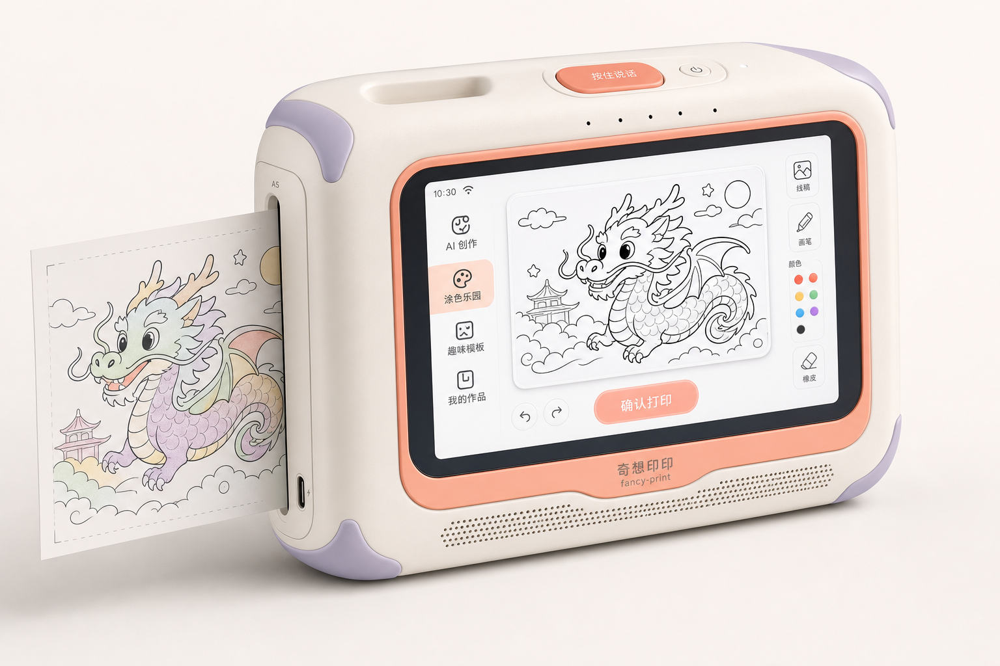

# 设计文档：儿童AI智能对话打印机（奇想印印 / fancy-print）

> 让孩子自己完成从"哇"到"拿到可以涂色的纸"的完整闭环。

**Generated by /office-hours on 2026-05-14**

**Status: DRAFT**

**Mode: Startup**

---

## 1. 问题陈述

### 核心痛点

5-12岁孩子想要定制化的安静书涂色页或换装内容，但现有AI工具（如豆包）只能生成屏幕上的图片，无法直接变成孩子能拿在手里涂色、剪贴的实物。孩子需要家长帮忙操作才能打印，整个体验在"生成"之后就断了。

### 用户故事

孩子对设备说"我要一张穿着粉色裙子住在城堡里的公主涂色页"，设备自动生成并打印。孩子拿到的是一张可以涂色、剪下来、贴墙上的纸。整个过程不需要家长在场。

---

## 2. 市场验证（Demand Evidence）

### 市场需求信号

| 信号 | 数据来源 |
|------|----------|
| 教育智能硬件高速增长 | 2024年中国教育智能硬件市场规模达739亿元，校外消费级575亿元 |
| "双减"后家长支出增加 | 70.4%的家长增加了儿童教育智能硬件支出 |
| AIGC应用爆发 | 2024年中国AIGC市场规模约209亿元，预计2030年突破10000亿元 |
| 便携无墨彩打（ZINK 等）成熟 | ZINK 纸供应链与「全彩、接触不易糊」能力可查；需与 OEM 锁定**可书写/哑面**等儿童向介质，并关注授权与单张成本 |
| 家长"喘息"需求 | 5-12岁儿童家长希望孩子能独立玩一会儿，不需要每次都介入 |

### 当前替代方案对比

| 方案 | 问题 |
|------|------|
| 豆包等AI App | 需要家长全程帮忙操作，孩子只能看屏幕 |
| 模板化安静书 | 不能定制内容，固定模板 |
| 照片打印机 | 需要手机配合操作，流程复杂 |
| 淘宝定制印刷 | 无法实时生成，需要等待物流 |

---

## 3. 现状分析（Status Quo）

### 家长当前的Workaround

1. **手机→电脑→打印机流程**：在手机/平板上用AI生成图片 → 传给电脑 → 连接打印机打印
2. **购买纸质安静书**：购买模板册，孩子反复使用相同内容
3. **淘宝定制印刷**：找店铺定制，但无法实时生成

### 当前成本

| 方案 | 时间成本 | 介入程度 |
|------|----------|----------|
| 完整流程 | 10-15分钟/次 | 需要家长全程介入 |
| 等待时间 | 30分钟以上 | 孩子只能看着屏幕 |

---

## 4. 目标用户与最小可行产品

### 目标用户画像

**核心用户**：5-12岁儿童的家长

**用户特征**：
- 一二线城市、中高家庭收入
- 3-8岁孩子为主（自主操作能力较强）
- 家长希望孩子能独立玩一会儿

**决策链路**：购买决策者 = 家长，实际使用者 = 孩子

### 最小可行产品 (MVP)

**硬件规格**：
- **产品形态**：**打印一体机** — ZINK 打印、主控、屏、拾音/放音集成在**单台可移动**设备内（非分体台式方案）。
- **便携**：内置 **≥4000mAh 级** 电池与 **Type-C 充电**；整机尺寸/重量以 **单手可拎、普通背包可装** 为方向；结构预留 **扣手或穿绳位**。
- 打印技术：**ZINK 全彩无墨**（染料在 **ZINK 纸** 基材内扩散显色；控温走纸，无独立墨盒）
- **打印幅面（PRD）**：**ISO A5（148×210 mm）** 级「涂色 / 安静书」单页出纸，与 [`0. 产品构想.md`](0. 产品构想.md#product-scenarios) **「场景与 PRD 要点」** 一致。  
  - **与 ZINK 的关系**：**市售 ZINK 口袋类成品** 的出纸多为 **常见口袋幅面**，单张面积 **通常远小于 A5**；若整机仍以 **ZINK 全彩无墨** 为主线，须在 **大画幅 ZINK OEM、宽幅/联张纸路**，或与 **A5 兼容的第二条打印引擎（如 A5 喷墨 / 热升华等）** 中择一并锁 BOM 与 Debian 打印栈。  
  - **工程样机**：BOM 与验收以 **A5 可达** 为准，见 [`2. 端侧软件与工程样机技术分析.md`](2. 端侧软件与工程样机技术分析.md#demo-kit-bom)。
- 交互方式：语音对话 + **约手机尺寸触控屏（约 5.9～6.8 寸）**：**FHD+、IPS 或高质量 OLED、全贴合**，孩子**看图确认**后再打印；靠 **高 PPI** 与亮度保证线稿可辨，**勿用 TN 低端模组**
- **外观与换壳**：整机造型的 **唯一渲染基准**（基础款）如下；主题外壳为可扩展 SKU，流程与命名见 [`2. 端侧软件与工程样机技术分析.md`](2. 端侧软件与工程样机技术分析.md#product-render-system) **§11**。

  

**核心功能**：
- 孩子独立完成：语音输入 → 内容生成 → **屏上预览确认** → 在 **定稿介质（A5 目标；主路线 ZINK 或其它已定引擎）** 上成图（全彩无墨或已定彩打方案）
- 支持模式：**可涂色**（线稿或淡彩底 + 高对比轮廓、预留涂色区）、**剪纸**（外轮廓加粗、钝角防戳）、**换装**（主体 + 服饰小片分卡等）；**版式与出血以 A5 画布为准**，具体可打印边界随 **OEM 介质幅面** 调整（见上条）。

**ZINK 纸（非「相纸」心智）**：
- **话术**：耗材统一称 **ZINK 纸**，强调「能涂、能剪、能贴」的手工与安静书场景，避免被理解成只给家长**洗照片用的相纸**。
- **介质**：与 ZINK 技术体系一致；量产宜与供应商锁定 **哑面 / 可书写** 等儿童向配方，并对蜡笔、水彩笔、油性笔做 **DOE**，确认附着力与蹭脏可接受。
- **图像策略**：避免满版「照片写实风」堵死涂色空间；以 **线稿优先 + 可选淡彩铺底** 为主，保证孩子仍有「自己上色」的参与感。

**定价对标**：整机更可能落在 **¥399–599** 带（对标儿童创意硬件 + **ZINK 纸**耗材包）；**不含屏口袋类**低价带不宜直接作对标，须随 **ZINK BOM** 单独重测。

**工程样机与量产端侧**：硬件 BOM、集成顺序、验收口径、量产 **Debian / Ubuntu 裁剪**、端上分层与 OTA 等 **统一见** [`2. 端侧软件与工程样机技术分析.md`](2. 端侧软件与工程样机技术分析.md#demo-kit-bom)（**§10** 工程样机，**§1～§9** 软件与运维）。**量产操作系统已定稿**：**Debian / Ubuntu 嵌入式裁剪**（与 Raspberry Pi OS 同属 Debian 系）。

### 4.5 阶段策略与决策门（Phase A / Phase B）

与仓库内 [`3. 端侧设计.md`](3. 端侧设计.md)、[`4. 服务器端设计.md`](4. 服务器端设计.md)、[`5. 家长端应用设计.md`](5. 家长端应用设计.md) 对齐的 **两阶段推进**（执行口径统一为本文 **§4.5、§5.7、§8.0、§8.4、§9、§12**，不再维护独立「儿童…计划书」文件）：

| 阶段 | 周期 | 目标 | 投入 |
|------|------|------|------|
| **Phase A — 混合验证** | 约 4 周 | App + **纸上打印模拟**（家用 **A5** 彩打等），验证语音→生图→安全→家长闸门→纸质闭环 | 低成本快速验证 |
| **Phase B — 硬件冲刺** | 约 8–10 周（Phase A **通过**后） | **一体便携**工程样机 + ZINK（或已定 OEM）全链路 | 全栈硬件投入 |

**Go / No-Go（Phase A → Phase B）**：须同时满足（量化口径见 **§9.2**）：儿童语音描述成功率、打印成品持续兴趣、**PQ** 输出满意度、家长愿意让孩子独立使用硬件、内容安全拦截率等阈值；**任一项不达标 → 不启动 Phase B**，回到产品定位与渠道假设复盘。

---

## 5. 详细技术选型

### 核心决策原则
- **儿童安全优先**：内容过滤、隐私保护是底线
- **端云协同**：轻量级端侧处理 + 云侧大模型能力
- **成本可控**：每台设备AI调用成本控制在1元/月以内

### 5.1 硬件选型方案

| 组件 | 方案A（成本优先） | 方案B（性能优先） | 方案C（推荐折中） |
|------|-------------------|-------------------|-------------------|
| **主控SoC** | 全志F1C200s (¥25) | 瑞芯微RK3566 (¥65) | 全志V3s (¥35) |
| **内存** | 64MB DDR2 | 2GB DDR4 | 128MB DDR3 |
| **打印模组** | 入门 ZINK、**常见口袋幅面** (¥95) | ZINK+切纸/大尺寸 (¥165) | 主流 ZINK OEM、**常见口袋幅面** (¥125) |
| **语音方案** | LD3320离线 (¥15) | 讯飞AIUI模组 (¥45) | 启英泰伦CI系列 (¥28) |
| **屏幕** | 5寸TN(¥45) | 7寸IPS(¥110) | **约6.3寸FHD IPS全贴合**（手机尺寸级看图确认，¥110） |
| **WiFi/蓝牙** | ESP8266 WiFi(¥8) | 双频WiFi+BT5.0(¥25) | RTL8720 WiFi+BT(¥15) |
| **电池** | 18650单节+充电(¥18) | 聚合物5000mAh(¥45) | **聚合物4000mAh一体便携**(¥35) |
| **BOM合计** | **~¥251** | **~¥530** | **~¥373** |
| **开模+组装** | ~¥50 | ~¥80 | ~¥60 |
| **整机成本** | **~¥301** | **~¥610** | **~¥433** |

> **打印幅面（与 §4 对齐）**：MVP 物理出纸为 **ISO A5**；上表三档仍以 **常见口袋幅面档 ZINK** 作**价位占位**。**A5 定稿后**「打印模组」行须按 **大画幅 ZINK 或 A5 第二引擎** 实价重算，**勿直接沿用本表整机成本**作 A5 方案结论。

**推荐方案C理由**：**打印一体机 + 便于移动** 要求下，屏取 **手机尺寸级（约 6 寸）**，以 **FHD+、IPS、全贴合、高亮度** 保障看图确认；电池用 **≥4000mAh** 支撑脱离插座演示。在 ZINK 机芯抬升 BOM 的前提下，仍优先保证在线文生图与全彩出纸体验。方案 A 算力与缓冲往往不足以支撑稳定 ZINK 图像管道，仅作极端降本参考。

### 5.2 语音交互方案对比

| 维度 | 讯飞AIUI | 百度语音 | 腾讯云语音 | 启英泰伦离线方案 |
|------|----------|----------|------------|-----------------|
| 儿童识别准确率 | ★★★★★（行业最优） | ★★★★ | ★★★★ | ★★★（离线局限） |
| 儿童音色TTS | ✅ 超拟人童声 | ✅ | ✅ | ❌ 仅基础合成 |
| 离线能力 | ❌ 需联网 | ❌ 需联网 | ❌ 需联网 | ✅ 完全离线 |
| 响应延迟 | 300-600ms | 500-800ms | 400-700ms | <100ms |
| SDK费用 | ¥0.15/次 | ¥0.12/次 | ¥0.10/次 | 一次性¥8/台 |
| 硬件集成 | AIUI模组即插即用 | 需自己调算法 | 需自己调算法 | 最简集成 |
| 推荐度 | ⭐⭐⭐⭐⭐ | ⭐⭐⭐ | ⭐⭐⭐ | ⭐⭐⭐⭐（辅助唤醒） |

**推荐策略**：主唤醒词使用启英泰伦离线方案（零延迟、零网络依赖），识别+对话使用讯飞AIUI（儿童场景体验最优）。双模组成本约¥35/台。

### 5.3 文生图模型选型

| 模型 | 图片质量 | 儿童内容安全 | 价格（千张） | 响应速度 | 备注 |
|------|----------|-------------|-------------|----------|------|
| **通义万相** | ★★★★ | ✅ 内容审核内置 | ¥3-5 | 2-3s | 性价比最优推荐 |
| 文心一格 | ★★★★ | ✅ | ¥5-8 | 3-5s | 百度生态整合好 |
| 豆包（字节） | ★★★★ | ✅ | ¥4-6 | 2-4s | 价格波动大 |
| Stable Diffusion XL | ★★★ | 需自建审核 | ¥2-3（自建） | 5-10s | 需要GPU服务器 |
| **推荐：通义万相** | — | — | — | — | 价格低+安全+速度快 |

**AI API年成本测算**（假设10万台活跃设备，月均100张/台）：
- API调用成本：¥500/万张 × 120万张/月 × 12月 = ¥7.2万
- 均摊至每台：¥0.72/台/年

### 5.4 软件系统架构

**量产端侧操作系统（已定稿）**：**Debian / Ubuntu 嵌入式裁剪**（只读根 / overlay、签名 OTA、常驻服务管理硬件与网络）。工程样机用 **Raspberry Pi OS** 验证业务；量产在定制 SoC 板上交付 **同源工具链** 的裁剪发行版，避免 Android 与 **CUPS / `lp` / ZINK 硬件文档**（[`2. 端侧软件与工程样机技术分析.md`](2. 端侧软件与工程样机技术分析.md#demo-kit-bom)、根目录 [`README.md`](../README.md)）主线分叉。

```
┌─────────────────────────────────────────────────────────┐
│                    硬件层 (Hardware)                      │
│  ┌──────────┐ ┌──────────┐ ┌──────────┐ ┌──────────┐   │
│  │ ZINK一体 │ │ 语音阵列 │ │手机尺寸屏│ │ WiFi/BT  │   │
│  │   模组   │ │  麦克风  │ │   屏幕   │ │   模组   │   │
│  └──────────┘ └──────────┘ └──────────┘ └──────────┘   │
└─────────────────────────────────────────────────────────┘
                           │
┌─────────────────────────────────────────────────────────┐
│                   系统层（嵌入式 Linux，Debian/Ubuntu 裁剪）              │
│  ┌─────────────┐ ┌─────────────┐ ┌──────────────────┐  │
│  │ 驱动管理层   │ │ 音频引擎     │ │ 网络协议栈       │  │
│  │ 打印/显示/   │ │ ALSA/TinyALSA│ │ lwIP/MQTT/HTTP  │  │
│  │ 按键驱动     │ │             │ │                  │  │
│  └─────────────┘ └─────────────┘ └──────────────────┘  │
└─────────────────────────────────────────────────────────┘
                           │
┌─────────────────────────────────────────────────────────┐
│                     应用层 (Edge)                        │
│  ┌──────────┐ ┌──────────┐ ┌──────────┐ ┌──────────┐  │
│  │ 唤醒引擎 │ │ 语音采集 │ │ 图片渲染 │ │ 内容缓存  │  │
│  │ (离线)   │ │ (降噪)   │ │ (打印)   │ │ (本地)   │  │
│  └──────────┘ └──────────┘ └──────────┘ └──────────┘  │
└─────────────────────────────────────────────────────────┘
                           │
                    (WiFi/4G)
                           │
┌─────────────────────────────────────────────────────────┐
│                      云服务层 (Cloud)                    │
│  ┌──────────┐ ┌──────────┐ ┌──────────┐ ┌──────────┐  │
│  │ 语音识别 │ │ 大模型   │ │ 内容审核 │ │ 用户中心  │  │
│  │ ASR/NLU  │ │ 文生图   │ │ 安全过滤 │ │ 历史记录 │  │
│  └──────────┘ └──────────┘ └──────────┘ └──────────┘  │
└─────────────────────────────────────────────────────────┘
```

### 5.5 离线/在线策略

| 功能 | 离线方案 | 在线方案 | 备注 |
|------|---------|---------|------|
| 唤醒词（"ZZNK小朋友"） | ✅ 本地芯片 | ❌ | 启英泰伦CI130x |
| 基础语音识别（简单指令） | ✅ 有限词表 | ✅ 完整ASR | 混合模式 |
| 复杂对话理解 | ❌ | ✅ 大模型NLU | 依赖云端 |
| 文生图 | ❌ | ✅ 通义万相API | 标准HTTP |
| 内容安全审核 | ✅ 基础过滤 | ✅ 深度审核 | 双重保障 |
| 打印队列 | ✅ 本地缓存 | ✅ 云同步 | AP模式时离线打印 |

### 5.6 当前技术局限与应对

| 局限 | 影响 | 应对策略 |
|------|------|----------|
| **A5 PRD 与常见口袋幅面不一致** | 若机芯仍为 **常见口袋幅面档**：须 **大画幅方案 / 第二条 A5 引擎 / 分片拼图（不推荐作主路径）** 之一写进 BOM；内容模板须 **A5 画布 + 安全边** | 与 OEM 锁定 **可书写 ZINK 或其它 A5 介质**；样机做 **A5 线稿可读性 + 涂色笔 DOE** |
| ZINK 单张耗材成本高 | 影响 LTV 与订阅/包张定价 | 与 [`0. 产品构想.md`](0. 产品构想.md#product-scenarios) 单张成本目标对齐；耗材包与会员权益重算 |
| ZINK 打印速度与功耗 | 连续出纸与续航压力 | 电池与热设计在 Phase B 实测；队列与预期管理（语音反馈） |
| 离线场景AI能力受限 | 无网络时无法生成内容 | 本地缓存模板库（预存100+基础模板） |
| 儿童语音识别准确率偏低 | 5岁以下孩子口齿不清 | 简化指令 + 触屏辅助 + 家长预设模板 |
| 云端API延迟 | 实时交互体验下降 | 本地缓存+预生成+流式返回 |

### 5.7 端云主链路、影子路径与多 API 降级（执行口径）

**主数据流（逻辑）**：`[录音] → [ASR] → [Prompt 安全审核] → [文生图 API] → [图像审核] → [下载] → [打印调用] → [TTS 反馈] → [云端存档（可选）]`。

**影子路径（摘要）**：对 **空输入 / ASR 失败 / Prompt 命中 / 文生图拒识或超时 / 图审打回 / 下载失败 / 缺纸卡纸 / TTS 异常 / 存档失败** 等，须在端云契约中定义 **儿童侧话术、重试次数、切备用 API、离线缓存图、家长告警** 等行为；超时阈值（如文生图 **15s** 级）与 **主备供应商** 切换规则见 [`4. 服务器端设计.md`](4. 服务器端设计.md)，设备侧队列与弱网见 [`2. 端侧软件与工程样机技术分析.md`](2. 端侧软件与工程样机技术分析.md)。

**多 API 降级（供应商层）**：默认主通路 **通义万相**；主通路超时 + 重试失败后 **自动切换备用**（如文心一格等，以商务与账号开通为准）；全云端不可用时可降级为 **设备本地缓存图集**（预设安全图）——详见云端编排设计，本文不展开账号与密钥。

---

## 6. 详细财务模型

### 6.1 定价策略

| 渠道 | SKU | 定价 | 对标参考 |
|------|-----|------|----------|
| 众筹早鸟 | 主机1台+ZINK 纸体验包+配件 | ¥349 起（待重算） | 档位须按 **ZINK BOM** 与渠道重测 |
| 电商零售 | 主机1台+入门 ZINK 纸包 | ¥399 起 | **ZINK BOM** 与渠道价弹性大，指导价须随报价重测 |
| 电商礼盒 | 主机1台+ZINK 纸包+配件 | ¥499 起 | 礼品场景定价上探 |
| 耗材包 | ZINK 纸（按张/按盒） | 按 OEM 成本与渠道另定 | 单张成本以 **ZINK 纸包**报价为准，显著影响 LTV |
| 会员订阅 | 无限生成+家长监控+内容历史 | ¥14.9/月 | 对标Haivivi增值服务 |

**定价依据**：Stickerbox 售价 $99.99≈¥729。采用 **ZINK** 后整机成本上移，中国渠道需在 **¥399–599** 等区间重新做价格带测试（可与众筹早鸟组合）。下文 `6.3` 损益表为 **早期占位算例**，与当前 **ZINK 纸包**售价及复购模型未完全对齐，**须整表重算**。

> **与 §6.2 对齐**：当前量产出厂约 **¥431** 时，若日常零售仍锚在 **¥399～599**，须明确 **BOM 能否压到约 ¥240～¥360（量级）** 或采用 **耗材/订阅补毛利**，否则硬件毛利不自洽；工程样机散件成本见 [`2. 端侧软件与工程样机技术分析.md`](2. 端侧软件与工程样机技术分析.md#demo-kit-bom)「样机几千块，那整机零售价该定多少？」一节。

### 6.2 成本结构明细

**硬件BOM成本（方案C：推荐折中方案）**

| 组件 | 型号/规格 | 单价 | 供应商类型 |
|------|----------|------|-----------|
| 主控SoC | 全志V3s | ¥35 | 深圳华强北 |
| ZINK 打印模组 | **常见口袋幅面** OEM 机芯（含走纸） | ¥118 | ZINK 授权 / OEM 供应商 |
| 语音方案 | 启英泰伦CI130x+讯飞AIUI | ¥35 | 成都/合肥 |
| 显示屏 | 约6.3寸FHD IPS全贴合触控（手机尺寸，看图确认） | ¥110 | 模组厂 |
| WiFi+BT | RTL8720 | ¥15 | 瑞昱方案 |
| 电池 | 聚合物4000mAh（一体便携） | ¥35 | 深圳格瑞普 |
| PCB+接插件 | 4层板+连接器 | ¥15 | 深圳 |
| 结构件 | 开模件+外壳注塑 | ¥20 | 深圳模具厂 |
| 包装配件 | 说明书+ZINK 纸体验包+配件 | ¥15 | — |
| **BOM合计** | | **¥398** | — |
| 开模费（分摊） | 10万套分摊 | ¥8 | ¥80万模具费 |
| 组装+测试 | 代工厂SMT+组装 | ¥25 | 东莞代工厂 |
| **整机出厂成本** | | **¥431** | — |

> **说明**：上表为 **ZINK + 打印一体便携 + 约手机尺寸高清屏（看图确认）+ 4000mAh 级电池** 的方向性 BOM；`6.3` 损益等仍为 **早期占位算例**，**整节随结构、屏厂、电芯与 ZINK 纸包报价滚动更新**。量产 **BOM 拧杠杆、定价与耗材模型** 在本文 **§6.1～§6.3** 内维护，并与 [`2. 端侧软件与工程样机技术分析.md`](2. 端侧软件与工程样机技术分析.md#demo-kit-bom) 样机成本口径对照。

### 6.3 三年损益预测 (P&L)

**核心假设**（⚠️ 以下仍为 **早期财务模版**下的示例演算；**ZINK 纸包**售价、单张成本与复购模型与下表数字未完全对齐，**须整表重算**）：
- 第一年销售3,000台，第二年15,000台，第三年50,000台
- 硬件毛利率：18%（示例：售价¥329，成本¥270）
- 耗材月均复购率：60%（示例：60% 用户每月复购 **1 份 ZINK 耗材包**；**包价与张数待 OEM**，下表收入/成本行为占位，勿作财务结论）
- 会员订阅转化率：首年15%，逐年提升至25%

| 项目 | 第1年 | 第2年 | 第3年 |
|------|-------|-------|-------|
| **销量** | 3,000台 | 15,000台 | 50,000台 |
| **累计用户** | 3,000 | 15,000 | 50,000 |
| | | | |
| **收入** | | | |
| 硬件收入 | ¥987,000 | ¥4,935,000 | ¥16,450,000 |
| 耗材收入 | ¥142,560 | ¥1,425,600 | ¥7,128,000 |
| 订阅收入 | ¥80,460 | ¥804,600 | ¥3,222,000 |
| **总收入** | **¥1,210,020** | **¥7,165,200** | **¥26,800,000** |
| | | | |
| **成本** | | | |
| 硬件成本 | ¥810,000 | ¥4,050,000 | ¥13,500,000 |
| 耗材成本 | ¥57,024 | ¥570,240 | ¥2,851,200 |
| 平台API费用 | ¥21,600 | ¥108,000 | ¥360,000 |
| **总成本** | **¥888,624** | **¥4,728,240** | **¥16,711,200** |
| | | | |
| **毛利** | **¥321,396** | **¥2,436,960** | **¥10,088,800** |
| 毛利率 | 26.6% | 34.0% | 37.6% |
| | | | |
| **费用** | | | |
| 研发费用 | ¥450,000 | ¥600,000 | ¥800,000 |
| 营销费用 | ¥300,000 | ¥900,000 | ¥2,500,000 |
| 管理费用 | ¥180,000 | ¥300,000 | ¥500,000 |
| **总费用** | **¥930,000** | **¥1,800,000** | **¥3,800,000** |
| | | | |
| **净利润** | **-¥608,604** | **¥636,960** | **¥6,288,800** |
| 净利率 | -50.3% | 8.9% | 23.5% |

### 6.4 现金流与盈亏平衡

| 项目 | 数值 |
|------|------|
| 初始投入（模具+研发+首批备货） | ¥500,000 |
| 月固定成本（按第1年） | ~¥78,000 |
| 单台毛利润（含耗材订阅） | ~¥107/台（首年算上耗材LTV摊销） |
| 月度盈亏平衡点 | ~730台/月 |
| 达平衡时间 | 第2年Q1（月销达成时） |
| 首年现金需求 | ~¥110万 |

### 6.5 单位经济模型（迭代版）

| 指标 | 保守 | 基准 | 乐观 |
|------|------|------|------|
| 客单价（硬件+首年耗材） | ¥329 | ¥329+¥79 | ¥329+¥158 |
| CAC（获客成本） | ¥200 | ¥150 | ¥100 |
| 月耗材复购率 | 40% | 60% | 75% |
| 月均耗材收入 | ¥2.64 | ¥3.96 | ¥4.95 |
| 订阅转化率 | 10% | 15% | 25% |
| LTV（24个月） | ¥543 | ¥792 | ¥1,180 |
| LTV/CAC | 2.7x | 5.3x | 11.8x |
| 投资回收期 | 14个月 | 8个月 | 5个月 |

### 6.6 融资规划

| 轮次 | 金额 | 时间 | 用途 |
|------|------|------|------|
| 种子轮/自筹 | ¥50万 | 第0月 | 原型开发+模具费 |
| 天使轮 | ¥200-300万 | 第6月 | 首批量产+市场推广 |
| Pre-A轮 | ¥800-1000万 | 第12-18月 | 产能扩张+品类扩展 |

---

## 7. 竞品深度分析

### 7.1 直接竞品：Stickerbox（Hapiko公司）

| 维度 | Stickerbox | 本项目（ZZNK） |
|------|-----------|---------------|
| **产品形态** | 3.75寸立方体 **黑白贴纸**口袋机 | **ZINK 打印一体便携机**+**约手机尺寸屏**（常见 6 寸级） |
| **目标市场** | 美国为主（$99.99） | 中国为主（建议价带 ¥399 起，待重测） |
| **打印内容** | 黑白贴纸（B&W sticker） | 可涂色 / 剪纸 / 换装等（线稿与淡彩策略见 MVP 节） |
| **交互方式** | 纯语音（按钮触发） | 语音+**约6寸级高清触控**+按键（一体便携看图确认） |
| **打印尺寸** | 小型贴纸 / **常见口袋幅面** | **PRD：A5（148×210 mm）**；整机实现以 **OEM 锁定的出纸规格** 为准（可为 **大画幅 ZINK** 或 **A5 第二打印引擎**） |
| **融资** | $700万（Maveron + Serena Ventures + AI2） | 待融资 |
| **团队背景** | Arun Gupta（前Grailed CEO）+ Bob Whitney（前Anthropic/NYT Games） | — |
| **上线时间** | 2025年11月 | 规划中 |
| **内容安全** | 摄像头无、最小数据收集、内置审核过滤 | 方案类似，增加屏幕侧展示 |


**Stickerbox关键启示**：
1. ✅ **需求被验证** — 融了700万美元（$7M），证明投资者相信这个方向
2. ✅ **产品市场匹配** — 首批假日季售罄，社交媒体病毒式传播
3. ✅ **团队背景强** — CEO来自Grailed（被收购），CTO来自Anthropic
4. ✅ **儿童安全卖点** — "不会在后台持续监听"的设计赢得家长信任
5. ⚠️ **中国市场空白** — Stickerbox目前仅在美国销售，中国没有同类产品
6. ⚠️ **价格差异** — $99.99 与中国区 **ZINK** 零售价需在 **¥399–599** 带重新验证付费意愿（原 ¥300 内假设随 BOM 失效）

### 7.2 间接竞品：BubblePal（Haivivi公司）

| 维度 | BubblePal | 本项目 |
|------|-----------|--------|
| **产品** | AI交互玩偶配件 | AI对话打印机 |
| **定价** | $89（¥649） | ¥399 起（方向价，待 ZINK BOM 锁定） |
| **核心功能** | 情感陪伴+对话+故事创作 | 语音生成+打印+涂色 |
| **儿童年龄** | 3-12岁 | 5-12岁 |
| **出货量** | 月销10,000+台 | — |
| **打印能力** | 无 | ✅ |

**关键启示**：BubblePal证明了家长愿意为AI儿童硬件付费（月销万台），且中国AI陪伴玩具市场正在爆发。但BubblePal是纯电子设备，孩子"看"和"听"，没有实物输出。本项目最大的差异化在于：**孩子拿到的是 ZINK 纸上的可涂色、可剪贴实物**（非屏幕虚拟内容），而非仅「看」和「听」。

### 7.3 行业竞品格局图

```
                      纯AI交互（无打印）
                        │
              BubblePal │ Ling!小方机
              (Haivivi) │ (千知精灵)
             $89 / 月销 │ ¥499/¥599
             10,000+台  │
                        │
               ┌────────┴────────┐
               │  本项目定位     │
               │  AI对话打印机   │
               │  ¥399+ / 孩子   │
               │  独立完成闭环   │
               └────────┬────────┘
                        │
               Stickerbox │ 喵喵机
               (Hapiko)  │ (作业帮)
              $99.99 /   │ ¥299-399
              B&W贴纸    │ 无AI功能
                        │
                   打印产品
```

### 7.4 差异化优势矩阵

| 维度 | 豆包/通义 | 模板安静书 | Stickerbox | 喵喵机 | **本项目** |
|------|----------|-----------|-----------|--------|----------|
| 孩子独立操作 | ❌ | ✅ | ✅ | ❌ | **✅** |
| AI定制内容 | ✅ | ❌ | ✅ | ❌ | **✅** |
| 实物打印输出 | ❌ | ✅ | ✅ | ✅ | **✅** |
| 中国本土优化 | ✅ | ✅ | ❌ | ✅ | **✅** |
| 彩色/涂色 | ❌（屏幕） | ✅ | ✅（涂色） | ✅（打印） | **✅（ZINK 纸：淡彩/线稿 + 孩子可再涂色）** |
| **A5 涂色 / 安静书页** | — | ✅（家用纸） | ❌（**常见口袋幅面**） | ❌（**常见口袋幅面**） | **✅（PRD 锚定 A5；依赖大画幅介质或 A5 打印引擎，与上表「打印尺寸」一致）** |
| 家长授权管控 | ❌ | ✅ | ❌ | ❌ | **✅** |
| 成本可及（¥300 内） | — | ✅ | ❌ | ✅ | **⚠️（本方案更可能落在 ¥399+ 带）** |

### 7.5 进入策略建议

面对Stickerbox这个直接的竞品，建议采取以下策略：

1. **错位竞争**：以 **A5 涂色 / 安静书** + **ZINK 全彩无墨（或已定稿的 A5 引擎组合）** 建立「创意手工」心智（不卖相纸洗照片）；**幅面与介质**在 BOM 定稿时与 OEM 一次性对齐，避免「屏上 A5、纸上仅为 **常见口袋幅面**」的体验落差。  
2. **价格带**：**A5 出纸 + 彩打方案** 定稿后指导价带上移，需在 **¥399–599** 做敏感点测试，不宜再承诺「¥300 内必达」。
3. **内容生态**：与中国教育大纲结合（拼音/数学/古诗词涂色），增加教育元素
4. **家长管控**：增加家长APP、内容记录、授权打印等功能，贴合中国家长期待
5. **社交裂变**：打印作品可拍照分享，形成UGC内容社区

### 7.6 护城河与中长期壁垒（摘要）

| 方向 | 周期（量级） | 说明 |
|------|-------------|------|
| 儿童引导与 Prompt 数据 | 6–12 个月 | 积累适龄表达与引导策略，形成专有微调或模板资产 |
| 家长侧留存 | 3–6 个月+ | 成长相册、家庭账号与合规审计链，提高迁移成本 |
| 工业设计与交互专利 | 6–8 个月 | 外观、快拆壳、儿童交互流程等布局专利组合 |
| 品牌与品类心智 | 12–18 个月 | 「儿童 AI + 可涂色实体输出」差异化占位 |

---

## 8. 产品路线图

### 8.0 Phase A / Phase B 与 Phase 1～3 的对应关系

**Phase A（约 4 周）** 与 **Phase B（约 8～10 周）** 是执行层的「先验证再砸硬件」节奏；下文 **Phase 1～3** 仍为商业与产品的 **6～12 个月级** roadmap。二者可作如下对齐（日历重叠以排期为准）：

| 执行阶段 | 建议周期 | 在商业路线图中的位置 | 交付焦点 |
|----------|----------|----------------------|----------|
| **Phase A** | 约 4 周 | **Phase 1 前半**：需求与链路证据 | App + 家用 **A5** 纸上模拟、三层安全、家长闸门、10 家庭测试、**Go/No-Go** |
| **Phase B** | 约 8～10 周（Phase A 通过后） | **Phase 1 中后段** 并切入 **Phase 2 量产准备** | 一体便携工程样机、打印驱动、结构手板、稳定性与 **CCC 等认证资料** |

**Phase A 周节奏（摘要）**：第 1 周 **ASR→文生图→App 展示** 与初级 Prompt 过滤；第 2 周 **纸上打印模拟**、图审与家长「允许/拒绝」、TTS、主备 API 超时切换；第 3 周 **PQ**（纸质输出满意度）、降级演练与测试脚本定稿；第 4 周 **10 家庭**实测与决策（流程模板见 **§12.2**）。

**Phase B 阶段块（摘要）**：需求冻结与物料（并行 CCC 咨询）→ 打印驱动与桌面 POC → 结构手板与整机组装 → 稳定性 / 版本冻结 / 认证递交与演示（见 **§8.4**）。

### Phase 1：MVP（0-6个月）

- **目标**：完成硬件原型 + 基础语音生成功能
- **验证**：找到100个种子用户进行测试
- **定价**：众筹价带 **¥349–449**（随 ZINK BOM 与 **ZINK 纸包**重算，**原低价档位假设作废**）
- **里程碑**：
  - [ ] 完成硬件原型开发
  - [ ] 完成基础语音交互功能
  - [ ] 完成基础文生图集成
  - [ ] 招募100名种子用户

### Phase 2：产品化（6-12个月）

- **目标**：量产上市，进驻天猫/京东
- **扩展**：增加更多内容模式（剪纸、拼贴等）
- **定价**：日常零售价 **¥449–599**（ZINK 量产后方向带，待 BOM 与渠道重算）
- **里程碑**：
  - [ ] 完成量产准备
  - [ ] 上线电商渠道
  - [ ] 日均订单破百
  - [ ] 推出会员订阅服务

### Phase 3：生态（12个月+）

- **目标**：推出耗材订阅、开放API
- **扩展**：内容商城、社交分享功能
- **目标**：年销售10万台
- **里程碑**：
  - [ ] 推出耗材订阅服务
  - [ ] 开放内容API
  - [ ] 上线内容商城
  - [ ] 启动社交功能

### 8.4 Phase A / Phase B 里程碑总表（执行）

| 块 | 周期（建议） | 核心目标 | 关键交付物 |
|----|-------------|----------|------------|
| **A1 App 原型** | Phase A 第 1～2 周 | 语音→生图→展示 + 安全雏形 + 家长端雏形 | App Demo、过滤组件 |
| **A2 体验验证** | Phase A 第 3～4 周 | 纸上打印模拟 + 10 家庭测试 | 用户测试报告、**Go/No-Go** |
| **B1 需求冻结** | Phase B 第 1～2 周 | 硬件选型/采购、API 环境、外形锁定 | BOM、架构图 |
| **B2 技术原型** | Phase B 第 3～4 周 | 全链路 + 打印驱动 | 桌面级打印 Demo |
| **B3 结构集成** | Phase B 第 5～7 周 | 3D 外壳、组装 | 工程样机组装 |
| **B4 联调验收** | Phase B 第 8～10 周 | 稳定测试、演示与文档 | Demo 样机、认证资料包 |

> **说明**：主数据流、影子路径与多 API 降级见 **§5.7**；云端编排与家长策略见 [`4. 服务器端设计.md`](4. 服务器端设计.md)、[`5. 家长端应用设计.md`](5. 家长端应用设计.md)；**周级 checklist** 若需展开，在项目管理工具中自 **§8.0 / §8.4** 拆解即可，本文不重复粘贴长清单。

---

## 9. 关键假设、安全、合规与风险

### 9.1 待验证假设

| 假设 | 验证方法 | 备注 / 阶段 |
|------|----------|-------------|
| 孩子能独立操作 | 观察 5～8 岁能否独立完成全流程 | Phase 1 |
| 家长付费意愿 | 访谈约 100 位家长，收集预约订单 | Phase 1 |
| 内容质量足够吸引孩子 | A/B 不同生成风格与任务卡反馈 | Phase 1 |
| **A1** 儿童能用语言描述想生成的内容 | App 语音交互与引导轮次统计 | Phase A 第 1～2 周 |
| **A3** AI 生成内容安全可控 | 三层过滤 + 攻击性 Prompt 集测 | Phase A 第 2 周 |
| **A4** 儿童对实体打印物有持续兴趣 | 纸上模拟 + **第 4 周**留存访谈 | Phase A |
| **PQ** 纸质输出满足 **A5** 线稿/涂色预期 | 家长 + 儿童双评满意度 | Phase A 第 3～4 周 |
| **A6** 5～12 岁需求不因年龄断层 | 分龄组（5～7 / 8～10 / 11～12）对比 | Phase A 第 4 周 |
| **A7** 家长允许孩子独立使用 | 访谈 + App 使用数据 | Phase A 第 3～4 周 |

> **商业假设（概要）**：「家长愿为孩子的想象力落到纸上付费」——方向调研已给出正面信号；**价格敏感带**在 Phase A **第 4 周**用档位（如 ¥299 / ¥399 / **¥449+** 等）实测，并与 **§6.1** 滚动对齐。

### 9.2 Go/No-Go（Phase A → Phase B）

**须同时满足**方可进入 Phase B（量化回填见 **§12.3**）：

- **A1**：≥70% 儿童在 **≤3 次引导** 内完成有效语音描述。  
- **A4**：≥60% 儿童在第 4 周仍对打印成品表现 **持续兴趣**。  
- **PQ**：打印输出满意度 **≥3.5 / 5**（家长 + 儿童双评）。  
- **A7**：≥70% 家长愿意让孩子在 **硬件形态** 上独立使用（在已体验 App 链路前提下）。  
- **安全**：攻击性 Prompt 拦截率 **≥95%**（约定实验样本集上统计）。  

任一未达标：不启动 Phase B 全栈硬件投入，回到 **§11** 与产品定位复盘。

### 9.3 内容安全与家长闸门（三层）

**第一层（端 / App）**：敏感词与黑名单（可云端同步）、意图分类、**5～12 岁**适龄策略。  
**第二层（云端）**：文生图输出 + **图像审核 API**（具体厂商与阈值以 [`4. 服务器端设计.md`](4. 服务器端设计.md) 为准）、置信度与人工队列。  
**第三层（家长端）**：默认 **「生成→推送预览→家长允许打印」**；可配置「信任模式」自动放行（见 [`5. 家长端应用设计.md`](5. 家长端应用设计.md)）。  

**对儿童 / 家长的典型话术（摘要）**：Prompt 命中 → 儿童侧温和拒绝 + 家长侧告警日志；图审拦截 → 儿童侧「需要爸爸妈妈看一下」+ 家长 **允许 / 拒绝**；重复越权按日阈值限制并建议亲子沟通。

### 9.4 数据隐私与合规要点

- 儿童相关语音：录音原文 **短留存 / 尽快删除** 策略以隐私政策为准；业务分析以 **ASR 文本** 为主保留物。  
- 画作默认 **家庭可见**，不默认进入公域。  
- **境内部署**与《个人信息保护法》《儿童个人信息网络保护规定》对标；DPIA 与数据安全评估在 Phase B 与 **§9.5** 并行推进。  

### 9.5 硬件安全与型式认证（中国）

| 项 | 说明 | 时机（建议） |
|---|------|-------------|
| **CCC** | 电源与电子信息产品强制性认证 | Phase B 启动即并行咨询 |
| **结构 / 电气 / 材料** | 机械强度、温升、电池固定、小零件与锐边 | Phase B 试产前 |
| **数据 / 儿童个人信息** | 合规评估与安全测试 | Phase B 中后段 |

硬件设计底线：纸仓防误开、锐边 **R≥3mm**、电池 **防儿童拆**、表面温升 **≤45°C**、最大音量 **≤85 dB**、接触材质 **GB 6675** 等（与 [`2. 端侧软件与工程样机技术分析.md`](2. 端侧软件与工程样机技术分析.md) 工程习惯互补）。

### 9.6 失败模式与应急响应（FMEA）

| 编号 | 场景 | 概率 | 影响 | 预防 | 应急响应 |
|------|------|------|------|------|----------|
| F1 | 文生图输出不当内容 | 低 | 致命 | 三层过滤 + 图审 API | 拦截 + 告警 + 人工队列 |
| F2 | 误食 **ZINK 纸** / 小零件 | 低 | 致命 | 锁扣 + 小零件与窒息风险评估 | 停售评估 + 法务 + 按需召回 |
| F3 | 主 API 长时间不可用 | 中 | 高 | 多供应商 + 离线缓存图 | 自动切备线 + 安抚话术 |
| F4 | 结构手板返工导致延期 | 高 | 高 | 预留 buffer、并行外发打样 | 压缩路径、增购打样渠道 |
| F5 | **ZINK** 画质与期望落差 | 中 | 高 | Phase A 提前评 **PQ** | 色彩管理与驱动参数迭代 |
| F6 | 家长投诉隐私 | 中 | 高 | **§9.4** 策略前置 | 个案沟通 + 政策与产品补丁 |
| F7 | 竞品快速跟进 | 中 | 中 | 数据与专利、渠道节奏 | 加速版本与差异化内容 |
| F8 | 大模型 API 涨价 | 中 | 中 | 多模型备选 | 成本模型与终端/订阅调价 |
| F9 | 儿童新鲜感下降 | 高 | 中 | 主题运营 + 家长分享 | 内容日历与社区功能排期 |

**分级响应**：F1 / F2 级 **立即**停相关能力或批次并升级负责人；F3～F6 **48 h** 内缓解方案；F7～F9 纳入常规迭代。

### 9.7 商业与运营风险（概要）

| 风险 | 应对策略 |
|------|----------|
| 儿童 AI 内容合规 | **§9.3～§9.6** + 必要时人工复核与版本回滚 |
| 硬件供应链稳定性 | 备选供应商，关键物料备货 |
| 大厂进入竞争 | **§7** 错位 + 快速建立品类心智与渠道壁垒 |

---

## 10. 成功标准

| 指标 | 6个月目标 | 12个月目标 |
|------|----------|------------|
| 销售量 | 1,000台 | 10,000台 |
| NPS | >50 | >60 |
| 活跃用户留存 | 60% | 70% |
| 毛利率 | 35% | 40% |
| 获客成本 | <200元 | <150元 |

---

## 11. 下一步行动（The Assignment）

### 立即执行

找到10个5-12岁孩子的家长，做深度访谈（不是问卷），问：

1. 孩子平时用什么方式"玩"安静书/涂色？
2. 你家打印过东西吗？孩子会操作吗？
3. 如果有一个设备，孩子自己说话就能打印，你会买吗？愿意花多少钱？

### 验证后再开发

**不要先开发产品，先验证需求是否真实存在。**

---

## 12. 附录

### 12.1 相关文档

| 文档 | 用途 |
|------|------|
| [`0. 产品构想.md`](0. 产品构想.md#product-scenarios) | 场景与 PRD 要点 |
| [`3. 端侧设计.md`](3. 端侧设计.md) | 端侧架构导读 |
| [`4. 服务器端设计.md`](4. 服务器端设计.md) | 云端编排、审核与 API 策略 |
| [`5. 家长端应用设计.md`](5. 家长端应用设计.md) | 家长 App、闸门与相册 |
| [`2. 端侧软件与工程样机技术分析.md`](2. 端侧软件与工程样机技术分析.md#demo-kit-bom) | 样机 BOM、OS、渲染与换壳 **§10～§11** |

### 12.2 Phase A 第 4 周：家庭测试流程（模板）

```
┌─────────────────────────────────────────┐
│ 1. 家长访谈（约 15 min）                 │
│    ├── 背景：年龄、画画习惯、现有玩具    │
│    ├── 痛点：「想看看我说的话」频率      │
│    └── 付费：¥299 / ¥399 / ¥449+ 敏感度  │
├─────────────────────────────────────────┤
│ 2. 儿童体验（约 20 min）                 │
│    ├── 自由探索 App                     │
│    ├── 任务：引导完成 3 次语音作画       │
│    └── 纸上成品：让孩子拿到打印物        │
├─────────────────────────────────────────┤
│ 3. 反馈（约 10 min）                     │
│    ├── 儿童：喜欢度、是否想继续玩        │
│    └── 家长：购买意愿、顾虑、改进建议    │
└─────────────────────────────────────────┘
```

### 12.3 Phase A → Phase B 决策表（模板）

```
Phase A 验证报告
━━━━━━━━━━━━━━━━━━━━━━━━━━━━━━━━━
执行日期：[填写]

验证项 A1 — 儿童语音描述成功率
  结果：___% 在 3 次引导内完成  |  标准：≥70%  |  判定：[通过 / 不通过]

验证项 A4 — 儿童持续兴趣率
  结果：___% 在第 4 周仍保持兴趣  |  标准：≥60%  |  判定：[通过 / 不通过]

验证项 PQ — 打印输出满意度（A5 线稿/涂色，见 PRD）
  结果：___/5（家长 + 儿童双评）  |  标准：≥3.5/5  |  判定：[通过 / 不通过]

验证项 A7 — 家长独立使用意愿（硬件形态）
  结果：___% 愿意让孩子独立使用  |  标准：≥70%  |  判定：[通过 / 不通过]

内容安全拦截率（攻击性 Prompt 集）
  结果：___%  |  标准：≥95%  |  判定：[通过 / 不通过]

━━━━━━━━━━━━━━━━━━━━━━━━━━━━━━━━━
Go/No-Go 最终判定：[通过 → 启动 Phase B / 不通过 → 重新定位]
关键发现：
备注：
━━━━━━━━━━━━━━━━━━━━━━━━━━━━━━━━━
```

---

*Generated by /office-hours — YC Office Hours style design doc*