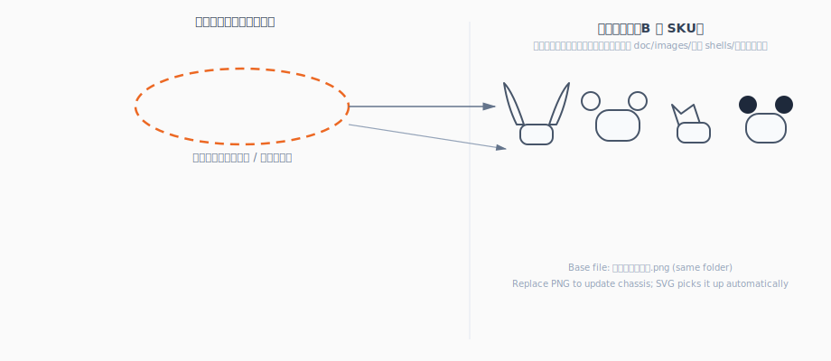

# 端侧软件与工程样机技术分析：操作系统、应用与硬件 BOM

> **摘要**：工程样机在 **Debian 系**（默认 **Raspberry Pi OS**，或板厂 **Debian / Ubuntu**）上验证业务；量产在定制 SoC 板上交付 **同源工具链** 下的 **裁剪 Debian / Ubuntu**（只读根 + overlay 或 A/B + **签名 OTA**）。端侧采用 **薄 UI、`edge-daemon` 管硬件、稳定 IPC、systemd 托管**；打印走 **`lp` / CUPS**（或厂商 SDK 封装进 daemon）。**工程样机硬件 BOM、Bring-up、样机成本与 A5/ZINK 幅面口径**见 **§10**；**机身基准图与换壳资产流程**见 **§11**；仓库入口与 ZINK 话术另见根目录 [`../README.md`](../README.md)；产品级 SoC 与量产 BOM 见 [`1. 项目计划书.md`](1. 项目计划书.md) **§5.1 / §6.2**。

**文档范围**：**§1～§9**（**Part A**）为 **量产端侧软件**：背景、原则、OS、架构、选型、外设集成、工程/运维与安全测试；**§10**（**Part B**）为 **工程样机硬件**（BOM、Bring-up、成本与前置验证）；**§11**（**Part C**）为 **成品渲染与换壳**（机身基准 PNG、示意 SVG、资产流程）；**§12**（**Part D**）为关联文档索引。下文 **「文档地图」** 给出推荐阅读顺序。本文 **不替代** PRD 全文与项目计划书财务算例。

---

## 文档地图（推荐阅读顺序）

| 部分 | 章节 | 读者 | 内容概要 |
|------|------|------|----------|
| **A** | **§1～§9** | 嵌入式 / 应用 / 运维 | 为何选 Debian 系、分层架构、`edge-daemon`、IPC、systemd、OTA、安全与测试交付 |
| **B** | **§10** | 硬件 / Bring-up | 工程样机 **E1～E15**、Debian 镜像选型、与量产收口表、成本与 Bring-up、前置验证档 |
| **C** | **§11** | 结构 / CMF / 设计 | **机身唯一基准图**（`images/` 下 PNG）、**模块化示意 SVG**、换壳分层与制图流程 |
| **D** | **§12** | 全员 | 仓库入口、项目计划书等外链 |

**端侧软件设计（结构化导读，与 Part A 互补）**：[`3. 端侧设计.md`](3. 端侧设计.md)。

**依赖关系简述**：**Part A** 规定样机与量产 **共用软件栈**；**Part B** 规定 **能通电闭环** 的样机硬件与 OS 冻结习惯；**Part C** 规定 **外观不对 drift** 的渲染与换壳纪律。PRD 幅面与 ZINK 口径以 **[`0. 产品构想.md`](0. 产品构想.md#product-scenarios)** 与 [`1. 项目计划书.md`](1. 项目计划书.md) 为准，本文 **§10.2** 与之对齐。

---

## 1 背景与问题空间

儿童 AI 打印一体机的端侧需同时满足：**触屏看图确认**、**语音与 PTT**、**ZINK 走纸**、**家长锁与内容策略**、**可远程升级**。若工程样机与量产采用 **不同发行族或不同打印模型**（例如样机 Linux、量产 Android），会出现 **驱动与业务逻辑双份维护、联调结论不可继承** 的高返工风险。

**已定稿结论**：量产操作系统采用 **Debian / Ubuntu 嵌入式裁剪**；与工程样机所用 **Pi OS / 板厂 Debian·Ubuntu** 同属 **Debian 包命名空间**，以便 **打印栈、SSH 排障、依赖构建** 从样机平滑延续到量产 rootfs。

---

## 2 设计原则与样机 / 量产对照

### 2.1 路线原则（一致、低门槛、可演进）

1. **技术路线一致**：工程样机与量产 **共用同一套软件架构**（Debian 系、UI / `edge-daemon` 分层、IPC、打印抽象），**禁止**「样机一套演示栈、量产换引擎或换打印模型」；允许的差别仅限于 **系统形态（只读根、包白名单）、OTA、产测与性能指标**。
2. **硬件与依赖就低不就高**：在 **满足 PRD 体验**（触屏确认、语音、走纸、续航、家长锁等）前提下，**SoC / 内存 / 存储** 与软件依赖 **尽量少**；避免仅为样机演示而引入 **量产不会继承** 的外设或封闭中间件。具体选型以 **§10.3** 工程样机主清单与项目计划书 **SoC 线** 为准。
3. **为功能升级留白**：样机阶段即落实 **daemon + IPC + 可 OTA 分区布局**；业务与功能开关 **数据驱动**（配置文件与 overlay，见 **§8**），避免逻辑写死在 UI 或一次性脚本中，使后续 **云端能力、打印策略、家长策略** 迭代 **无需换板或推倒栈**。

### 2.2 端上 / 云端职责边界

| 维度 | 端上 | 云端 |
|------|------|------|
| **交互与管控** | 触屏看图确认、家长锁、本地缓存、调用打印 / 音频 / 网络 | ASR、文生图、审核、家长策略 |
| **实现约束** | UI **不**直接操作 USB 打印机字节流；经 IPC 调用 `edge-daemon` | 经 **HTTPS / MQTT** 与 **cloud-connector** 对接 |
| **运行与升级** | 根文件系统 **只读 + overlay**（或 A/B）；**systemd** 托管；**OTA** 升级 | 协议与内容策略版本迭代 |

### 2.3 工程样机与量产的本质差别

| 维度 | 工程样机（Debian 系：Pi OS / 板厂 Debian·Ubuntu） | 量产 |
|------|----------------------------------|------|
| **硬件** | 树莓派等开发板 | 定制 PCB + 选型 SoC / 存储 / 屏模组 |
| **系统** | 官方镜像，开发期可 `apt` 装包 | **裁剪 Debian/Ubuntu** + **只读根** + **受控 OTA**；**禁止**依赖终端用户 `apt upgrade` |
| **应用** | 可 Python + venv、Chromium kiosk 等快速验证 | 强调 **冷启动时间、内存占用、看门狗、OTA、签名校验** |
| **维护** | 人工 SSH | **远程 OTA**、日志与版本矩阵 |

量产阶段将目标从「能跑」提升为 **产线可烧录、现场可回滚、家长端可预期**。

---

## 3 操作系统基线（已定稿）

在 SoC 厂 **Linux BSP** 上交付 **裁剪后的 Debian 或 Ubuntu**（Server / Minimal / 板厂预集成镜像再瘦身均可），通过 **preseed、debootstrap 或镜像流水线** 移除与 PRD 无关的包，保留 **systemd、网络、音频、显示、USB、CUPS/IPP、OTA agent** 等必要栈。量产形态为 **只读根 + overlay**（或 **A/B rootfs**），内核与 rootfs 升级走 **签名 OTA**。

**Android**：**不作为本项目量产主路径**。若供应商将来 **仅** 提供 Android 打印 SDK，须走 **变更控制 / 单独立项** 再评估。

### 3.1 曾评估但未采纳的基线（备忘）

| 方案 | 概要 | 未作为主路径的原因 |
|------|------|-------------------|
| **Buildroot / Yocto 极小 rootfs** | 镜像更小、攻击面更可控 | 包生态弱于 Debian；从 Pi 样机迁移与联调成本高；**仅当存储或启动指标极端吃紧时** 再单列评估 |
| **Android** | HAL + 应用以 Java/Kotlin 为主 | 与仓库 **Linux + CUPS + ZINK** 主线不一致；打印与常驻后台服务不确定性大 |

### 3.2 镜像与包清单（与工程样机对齐）

量产 rootfs **不另起炉灶换发行族**，在 **与样机相同的 Debian/Ubuntu 包命名空间** 内做减法与冻结：

1. **样机冻结输出**：在 Pi OS 或板厂镜像上记录 **`uname -r`、CUPS/打印相关包、音频栈、显示栈** 版本；导出 **`dpkg --get-selections`**（或 Ubuntu manifest 等价物）作为 **白名单初稿**。
2. **流水线构建**：使用 **debootstrap + 显式包列表**（或板厂 SDK + 再瘦身）在 CI 中 **可重复构建** rootfs，与样机行为做 diff；禁止依赖工程师本机「随手 apt」。
3. **收口策略**：量产镜像 **仅含白名单包**；开发期调试包在 **发布分支** 剔除；与 **§10.4**「版本冻结」及 **§7.1** 工程习惯一致。
4. **内核与驱动**：跟随 SoC 厂 **LTS / BSP**；将样机已验证的 **屏、USB、声卡** 组合写入 **硬件兼容性矩阵**，OTA 升级时同步回归。

---

## 4 端侧应用架构

将 **硬件敏感逻辑** 与 **UI** 分离，便于产测 mock、OTA 分包与替换 UI 技术栈。

```
┌─────────────────────────────────────────┐
│  UI 层（看图确认、家长锁、设置）          │
│  全屏 kiosk 或 Qt 主窗口                 │
└─────────────────┬───────────────────────┘
                  │ 本地 IPC（D-Bus / Unix socket / gRPC；择一，全仓库统一）
┌─────────────────▼───────────────────────┐
│  edge-daemon（常驻，C++/Rust/Go）         │
│  · 打印队列 · ZINK/CUPS 或厂商 SDK        │
│  · 音频采集/播放 · 唤醒/PTT GPIO          │
│  · 离线任务队列 · 磁盘缓存                │
└─────────────────┬───────────────────────┘
                  │ HTTPS / MQTT
┌─────────────────▼───────────────────────┐
│  cloud-connector                        │
│  （可与 daemon 同二进制或拆分）           │
└─────────────────────────────────────────┘
        并行：ota-agent（A/B 分区 + 签名验签）
```

**架构约束**：UI 进程崩溃 **不丢失** daemon 内打印队列；`edge-daemon` **无界面**、可独立升级（与 **§7.6** OTA 包拆分策略一致）。

---

## 5 关键技术选型

### 5.1 UI 框架（三选一，可阶段切换）

| 路线 | 适用场景 | Debian 裁剪镜像注意点 |
|------|----------|------------------------|
| **Qt 6（QML/C++）** | 一体机动画、多页导航；与 Wayland/X11 集成成熟 | `qt6-base` 等须纳入 **manifest**；可交叉编译或板载原生构建 |
| **嵌入式 Web（本地 HTTP + WebView）** | 与样机 **Web + kiosk** 延续最快 | 量产优先 **Qt WebEngine** 或 **WPE WebKit**（`wpe-webkit`），避免完整桌面 Chromium；静态资源放只读分区 |
| **LVGL + 自绘** | 极低内存、极简 UI | 与 DRM/KMS 或 fb 绑定深，Bring-up 成本通常高于 Qt/Web |

**不建议作为量产默认**：嵌入式 Linux 上 **完整桌面 Chromium + Electron** 作为唯一 UI（内存与 OTA 体积压力大）。若产品坚持 Web UI，采用 **裁剪浏览器壳 + 单页应用**（WebEngine 或 wpe-webkit）。

### 5.2 与 `edge-daemon` 的 IPC 契约

须在仓库内维护 **OpenAPI 或 protobuf**（带版本号），至少覆盖：

- **预览**：云端预览 URL 或本地缩略图路径。  
- **打印任务**：任务 ID、纸张规格（A5 PRD）、色彩/线稿模式、优先级、超时。  
- **错误码**：可映射到 UI 文案（卡纸、缺纸、网络、审核拒绝等）。  
- **家长锁**：只读查询 + 受控写（daemon 侧校验）。

UI **仅通过 IPC 调用 daemon**，不直接执行 `lp`，以便权限收敛与产测替换实现。

---

## 6 打印、音频与触屏（集成要点）

- **打印**：UI → IPC → `edge-daemon` → **`lp` / libcups / 厂商 SDK`**。A5 与 ZINK 介质边界见 **§10.2** 及根目录 [`../README.md`](../README.md)。
- **音频**：优先 **PipeWire**（与多数 Debian 系镜像一致）；由 daemon 或 `audio-helper` 通过 IPC 暴露 **录音 / 播放 / 设备切换**，避免多进程争用设备。
- **触屏**：校准文件进入镜像只读层或 overlay；分辨率与 DPI 与 **PRD 屏规格**（见 **§10.3** 主清单 **E7**）一致。

---

## 7 工程方法、部署与运维

### 7.1 开发环境与迭代节奏（工程样机阶段）

- **IDE**：VS Code / Cursor **Remote-SSH** 至板端（`ssh` 开启；镜像与 **§10.4** 工程样机 OS 表一致）。  
- **依赖**：允许 `apt install` 调试包；**至少每周**导出 `dpkg --get-selections` 或与量产共用的 **包列表 YAML**，标注「仅开发 / 可进量产」。  
- **显示栈**：Wayland（如 labwc/Weston）或 X11；与量产目标 **尽早对齐**，避免量产更换合成器导致 Qt/Web 行为漂移。

### 7.2 量产前镜像收口

- 应用与依赖改为：**CI 内 debootstrap + manifest 安装**，或可复现的 **`.deb` / 静态二进制** 拷入 rootfs。  
- 移除开发用 SSH 私钥、编译器、无关字体与文档包（参见 **§10.4**「与量产衔接」表）。  
- **内核、CUPS、声卡** 版本登记入 **硬件兼容性矩阵**（与 **§3.2** 一致）。

### 7.3 交叉编译（可选）

在 **Debian/Ubuntu x86_64** 上使用与目标 ABI 一致的 **toolchain + sysroot**（或 `sbuild` / `pbuilder` arm64）。**debug 包** 仅进内测通道；发布通道 **strip + 符号表分离**。

### 7.4 systemd 与服务编排

| 单元 | 建议 |
|------|------|
| `edge-daemon.service` | `After=network-online.target`，`Restart=always`，限频重启；环境变量使用 `EnvironmentFile=-/etc/fancy-print/device.env`。 |
| `fancy-print-ui.service` | `After=edge-daemon.service`；失败策略与看门狗（含可选硬件狗）与产品约定。 |
| `ota-agent.service` | 独立用户与 capability；仅写入 OTA 分区与状态文件。 |

**图形会话**：kiosk 场景可用 **自动登录 tty + startx** 或 **Wayland compositor 自启**；避免完整 GNOME/KDE。

### 7.5 样机到量产迁移检查项

前提：样机已按 **§10.4** 选用 **Debian 系 OS**，并完成打印 / 音频 / 触摸等「与量产衔接」验证。

1. **接口契约先行**：在样机板上将预览、打印任务 JSON、错误码固化为 **OpenAPI 或 protobuf**，量产 `edge-daemon` **实现同一契约**，减少 UI 改动面。  
2. **业务逻辑上移**：ASR、文生图、审核尽量在 **云端**；端上聚焦 **缓存、重试、脱敏日志**。  
3. **打印抽象稳定**：样机可用 `lp`；量产在 daemon 内维护 **`PrintJob`** 抽象，底层接 **CUPS 或厂商闭源库**，UI 不感知。  
4. **配置单一来源**：使用 **统一配置文件**（只读分区 + 可写 overlay）描述打印机型号、屏参数、功能开关；产线 **逐台写入序列号与校准数据**。

### 7.6 OTA、版本与回滚

| 项 | 建议 |
|----|------|
| **分区** | **A/B rootfs** 或 **双槽镜像**；升级失败 **自动回滚** 至上一版本。 |
| **签名** | 镜像与增量包 **私钥签名、设备验签**；禁止未签名包写入启动分区。 |
| **通道** | **灰度发布**（内测设备号段 → 全量）。 |
| **遥测** | 脱敏上报 **崩溃栈、打印失败码、OTA 结果**；合规与隐私条款前置。 |

量产 **禁止**依赖用户执行 `apt upgrade` 随机升级内核；内核与 rootfs 变更纳入 **自家 OTA** 与版本矩阵。

### 7.7 产线、老化与 CI

- **工厂镜像**：一键烧录 **eMMC/闪存**；分区布局为 **裁剪 Debian/Ubuntu**（只读根 + overlay 或 A/B）；首次开机 **自检**（屏、触摸、麦、喇叭、走纸、WiFi）。  
- **老化**：高温高湿与 **连续打印 N 次** 纳入产测脚本，与 **§10.6** Bring-up 末环对齐。  
- **CI**：在 **Debian/Ubuntu 容器或 debootstrap 环境** 构建 **rootfs manifest** 与 **edge-daemon/UI**；执行 **单元测试 + 模拟打印**；关键路径可配置 **夜间硬件台架**（SoC 板尽量与样机/量产一致）。

---

## 8 安全、配置与隐私

**安全（儿童场景底线）**

- **HTTPS** 固定证书链、**证书钉扎**（视威胁模型）；密钥 **不得明文** 打入镜像，采用 **每机注入** 或安全元件。  
- **内容安全**：与云端审核策略一致；端上 **家长锁 / 打印确认** 与 PRD 一致。  
- **依赖与 CVE**：rootfs **最小包集**；建立 **CVE 扫描与 LTS 内核** 更新节奏。

**配置与隐私**

- **全局配置**：`/etc/fancy-print/config.yaml`（只读）与 `/var/lib/fancy-print/`（可写 overlay）分离 **静态配置与运行态**。  
- **密钥与凭证**：不进 Git；产线注入 WiFi 凭证、设备证书等。  
- **日志**：结构化日志与崩溃转储路径受控；上传前 **脱敏**（避免儿童语音原文等持久明文存储，与法务及 PRD 对齐）。

---

## 9 测试与版本交付物

### 9.1 测试矩阵（APP 团队）

| 类型 | 内容 |
|------|------|
| **单元** | IPC 编解码、错误码映射、离线队列重试。 |
| **集成** | daemon + CUPS 假队列 / 真机打印模组；断网、弱网、云端 429/5xx。 |
| **E2E** | Bring-up「连续对话打印 N 次」脚本化（见 **§10.6**）。 |
| **OTA** | A/B 切换后 UI 与 daemon 版本匹配；回滚后配置完整可恢复。 |

### 9.2 发布交付物（建议纳入版本发布说明）

1. UI 与 `edge-daemon` **可执行文件**及 **systemd unit** 文件。  
2. **IPC 契约**（OpenAPI / proto）与 **错误码表**。  
3. **manifest 片段**（应用依赖包列表，及与量产 rootfs 的合并说明）。  
4. **运维说明**：工厂自检入口、日志抓取命令（供售后与研发联调）。

---

**进入 Part B（工程样机）之前**：若你只关心 **量产 OS 与端上应用**，读完 **§1～§9** 即可；若你要 **搭第一台样机或评审 BOM**，从 **§10** 起读；若你管 **外观 / 手板 / 渲染资产**，重点读 **§11**（基准 PNG / 模块化 SVG 在 **`doc/images/`**）。

<a id="demo-kit-bom"></a>

## 10 工程样机硬件 BOM 与集成清单（ZINK 打印一体机）

**§10 描述对象**：**第一台可拿得出手的工程样机** — **打印一体机**、**便于移动**、**约手机尺寸触控屏**（孩子看图确认后再打 ZINK 纸）。  
样机阶段允许 **亚克力 / 3D 打印堆叠**、线材外露；以 **功能闭环 + 可复现问题** 为优先，外观工艺后置。

**整机外观与换壳纪律**：对外与手板讨论须遵守 **§11** 的 **唯一基准图与 A/B 分层**；样机 **E13** 堆叠须预留与基准图一致的 **屏区、出纸口、PTT** 关系，避免手板与渲染各画各的。

**操作系统口径（与量产一致）**：量产已定为 **Debian / Ubuntu 嵌入式裁剪**（见上文 **§3**）。工程样机 **只选 Debian 系**：**Raspberry Pi OS**（Debian 同源）或 **板厂官方 Debian / Ubuntu** 镜像，**避免**样机用与 Debian 包体系不一致的发行版，以免打印栈与依赖到量产推倒重来。
**重要**：很多消费级 ZINK 机仅 **蓝牙 + 厂商 App**。工程样机主控若走 **Linux 单板**，务必提前验证打印机是否支持 **USB 打印类 / IPP** 或厂商 **ARM SDK**；否则打印链路会卡在工程样机之外。

---

### 10.1 工程样机定义（本仓库口径）

| 项 | 说明 |
|----|------|
| **是什么** | 可通电运行的一体化原型：**主控 + 满足 A5 PRD 的打印出纸 + 约 6 寸级屏 + 电池 + 麦/喇叭 + 按键**，软件可跑通「语音/触控 → 出图 → 确认 → 打印」。 |
| **不是什么** | 不是量产结构、不是认证样机、**不是** Tier A「手机 + 口袋打印机」那种渠道验证（那是前置手段，见文末）。 |
| **交付物** | 1）能拎到会议室演示的整机；2）BOM 与接线表；3）已知问题清单（供电、驱动、发热、走纸）。 |

---

### 10.2 与 PRD「A5 出纸」的关系（必读）

- **[`0. 产品构想.md`](0. 产品构想.md#product-scenarios) 与项目计划书**将物理出纸锚定为 **ISO A5（148×210 mm）**；工程样机 **E5/E6 所选机芯与纸** 须按该幅面（或已备案的 **A5 第二打印引擎**）选型，**不以更小休闲幅面替代 PRD**。  
- 整机定稿前须与 OEM 明确：**可书写介质、纸路、驱动与 CUPS/SDK**。  
- 内容管线：版式以 **A5 画布** 出稿，再按 **实际可打区域** 裁切或分页（避免屏上满幅、纸上缩版的心智落差）。

### 10.3 工程样机主清单（必采 / 核心闭环）

目标：**一块可拎、可脱插座短时运行** 的设备 — Linux 单板 + **约 5.9～6.8 寸** 触控屏 + **≥4000mAh** 电池 + **打印单元（E5，幅面须满足 PRD：ISO A5）** + 声学 + PTT 键。

| 序号 | 配件名称 | 规格建议 | 数量 | 用途 |
|------|----------|----------|------|------|
| E1 | **单板计算机** | **树莓派 5（建议 8GB）** 或 **RK3588S 等 ARM 开发板**；须 **USB Host 稳定**、可长期跑 Linux | 1 | 工程样机主控 |
| E2 | **系统存储** | MicroSD **≥64GB** A2/U3；有条件上 **NVMe 底板 / eMMC** 降低掉卡风险 | 1 | 系统与镜像 |
| E3 | **主电源（调试台）** | 树莓派 5：**官方 5V/5A USB-C PD**；其他板卡按厂商要求 | 1 | 实验室稳定供电 |
| E4 | **带供电 USB Hub** | USB3.0 + **独立电源 ≥36W** | 1 | ZINK 与麦克风同时上电不欠压 |
| E5 | **ZINK（或其它已定）打印单元** | **幅面须满足 PRD：ISO A5**（或 OEM 等效大画幅）；**须与主控驱动方案绑定**：**USB 打印类 / IPP** 或厂商 **Linux CUPS / ARM SDK**；下单前做 **打测试条** | 1 | 工程样机核心风险点 |
| E6 | **ZINK 纸（耗材）** | 与 E5 **同规格**；样机阶段多备 **≥3 包** | 若干 | 试打、废片、对比 |
| E7 | **显示屏（手机尺寸级）** | **约 5.9～6.8 寸**、**FHD+**、**IPS 或 OLED**、**全贴合电容触控**；亮度建议 **≥450 cd/m²**；**避免 TN**。优先 **HDMI+USB 触** 套件降低 bring-up；DSI 需预留驱动周期 | 1 | 看图确认、UI |
| E8 | **内置电池** | **≥4000mAh** 聚合物 + **保护板** + **Type-C PD 充放**（样机可用合规移动电源 **模块化固定** 过渡） | 1 | 「便携」可演示 |
| E9 | **USB 麦克风** | 小体积全向麦；线长够壳体布局 | 1 | 语音输入 |
| E10 | **扬声器** | 小腔体喇叭 + 功放板（或 USB 音箱过渡） | 1 | TTS / 提示音 |
| E11 | **按住说话键** | 轻触 + 上拉，或 **USB HID 大按键** | 1 | PTT 交互 |
| E12 | **杜邦线、端子、热缩管** | 常规套件 | 1 套 | 飞线、改线 |
| E13 | **机械承载** | **3D 打印框架 / 亚克力板 + 铜柱**；预留 **扣手或穿绳孔**；打印机与主板 **减振** | 1 套 | 一体形态与搬运 |
| E14 | **串口 / USB 调试线** | USB-TTL 或板载调试口线 | 1 | 内核与驱动排障 |
| E15 | **热像仪或温枪（借用）** | — | 1 | ZINK 连续走纸温升记录 |

### 10.4 工程样机操作系统（装什么）

**原则**：与上文 **§3**、**§3.2** 对齐 — 仅 **Debian 系**；开发期可用 **apt** 装调试包，**收口前**对照量产 **manifest 白名单** 删包并再测打印 / 音频 / 触摸全链路。

| 主控（E1） | 推荐系统 | 说明 |
|------------|----------|------|
| **树莓派 5**（文档默认） | **Raspberry Pi OS（64-bit）Bookworm** | **首选 [Lite](https://www.raspberrypi.com/software/operating-systems/)**：无桌面、省内存，适合自跑 **Qt / Wayland / Chromium kiosk** 做「看图确认」UI。需要快速摸屏、浏览器、CUPS 时用 **Desktop 版**，确认后再收敛到 Lite。 |
| 树莓派 5 | **Ubuntu Server 24.04 LTS（官方 Pi 镜像）** | 与量产 **Ubuntu 裁剪** 最接近；**须自行验证** USB 打印 + CUPS 全链路。 |
| **RK3588 等国产 ARM 板** | **板厂随附 Debian / Ubuntu 镜像** | 勿随便换「通用」第三方镜像，避免 **HDMI/MIPI 屏、WiFi、声卡** 驱动踩坑；与 **E7 屏** 绑定同一 BSP。 |

**不建议工程样机首版**：纯 **Yocto/Buildroot 极小系统**（除非有专职 BSP）。**Android 不作为本项目主路径**，首版勿在样机上赌 Android 打印栈。

**打印与音频**：用发行版自带的 **CUPS**（或厂商指定 **IPP/USB** 栈）接 **E5**；拾音放音走 **PipeWire** 或 **ALSA**（按镜像默认即可）。触摸屏在 X11/Wayland 下校准后 **冻结配置**。

**版本冻结**：记录 **镜像文件名、`uname -r`、关键包版本**；演示与评审前关闭 **无人值守升级**，避免「昨晚还能打、今早内核更了不能打」。冻结物应能喂给量产 **rootfs manifest**（见上文 **§3.2**）。

应用开发方式（UI 选型、Remote-SSH、CUPS、systemd 等）见上文 **§5**、**§7**。

#### 与量产「Debian / Ubuntu 裁剪」的衔接（收口检查）

| 检查项 | 样机阶段 | 量产前须完成 |
|--------|----------|----------------|
| **发行版族** | 仅 Debian 系（上表） | 同族 **裁剪 rootfs**；无发行版切换 |
| **包管理** | 可用 `apt` 迭代 | 镜像内 **移除 apt** 或禁用在线源；仅 **OTA** 升级 |
| **打印栈** | `lp` / CUPS 与 E5 绑定验证 | `edge-daemon` 内同一抽象；**不更换**为 Android 打印模型 |
| **证据留存** | 版本冻结记录 | `dpkg --get-selections` 或等价 **manifest** 入仓，与 CI 构建一致 |

**软件侧（工程样机必备）**：在 **Debian 系**镜像上固定 **OS 版本**、**内核 / CUPS / 应用** 的 commit；预装 **远程日志**（或网线 SSH）；打印前 UI 走 **确认 / 重试** 与 **线稿 / 淡彩内容策略**（与根目录 [`../README.md`](../README.md) 开篇 ZINK 产品话术一致）。产出须能映射到量产 **manifest**（见上文 **§3.2**）。

---

### 10.5 工程样机成本（物料 vs 量产）

工程样机成本通常按 **「散件零售价 + 试错备料」** 核算，**不等于**量产整机出厂价。量产方向性 BOM 见 [`1. 项目计划书.md`](1. 项目计划书.md) **§6.2**（当前文档内口径约 **物料 ¥398 / 含分摊与组装出厂约 ¥431**，随屏、机芯、电芯报价会变）。

#### 与量产的差异（为何样机会更贵）

| 维度 | 工程样机 | 量产（参考 §6.2） |
|------|----------|-------------------|
| **系统** | **Debian 系**（Pi OS / 板厂 Debian·Ubuntu），可 `apt` 迭代 | **裁剪 Debian/Ubuntu** + 只读/OTA（见上文 **§3**） |
| 主控 | **开发板零售价**（如树莓派 5） | 定制主板 + SoC 批量价 |
| 打印 | **整机或模组零售价**、未必拿到 OEM 底价 | ZINK 机芯批量议价 |
| 结构 | **3D 打印 / 亚克力手板**，件少价高 | 注塑开模后摊销 |
| 备件 | **双份线材、多包纸、备用 SD** 常见 | 按良率配置 |
| 结论 | 单台物料常为量产 BOM 的 **约 2～4 倍**（量级）；含外发打样、快递另计 | 以报价单为准 |

#### 主清单（E1～E15）单台物料区间（人民币，零售含税量级）

以下为 **2026 年前后国内电商零售价** 的经验区间，**不含**工程师人天、场地与认证；**E5 打印单元**因「成品口袋机 vs USB 机芯 vs OEM 模组」价差极大，单独给宽档。

| 序号 | 配件 | 省钱档（¥） | 推荐档（¥） | 宽裕档（¥） | 备注 |
|------|------|------------|------------|------------|------|
| E1 | 单板 | 350～500（Pi4/4G 等，不推荐） | **550～800**（Pi5 8GB 或同级） | 900～2500（RK3588 套件） | 样机建议 **≥8GB RAM** |
| E2 | 存储 | 40～80 | **60～120** | 150～400（含 NVMe 底板） | 备 **第 2 张 SD** 防坏卡 |
| E3 | 台架电源 | 60～100 | **80～150** | 同左 | 须满足峰值电流 |
| E4 | 带供电 Hub | 80～150 | **120～220** | 200～350 | 打印峰值勿欠压 |
| E5 | ZINK 打印 | 300～600（成品机改接） | **500～1200** | 1200～3500（机芯/OEM） | **驱动未定前勿压预算下限** |
| E6 | ZINK 纸 | 50～100（1 包） | **120～280**（3 包试打） | 300～600 | 废片多 |
| E7 | 6 寸级触屏 | 350～600 | **500～900** | 900～1800 | HDMI 套件易 bring-up |
| E8 | 电池/PD | 80～150（移动电源过渡） | **150～350**（芯+板） | 400～800 | 须带保护板 |
| E9 | 麦克风 | 30～80 | **50～150** | 同左 | |
| E10 | 扬声器 | 20～60 | **40～120** | 同左 | 含功放或小 USB 音箱 |
| E11 | PTT 键 | 10～30 | **20～50** | 同左 | |
| E12 | 线材套件 | 30～80 | **50～120** | 150～300 | 含杜邦、Type-C、扎带 |
| E13 | 结构手板 | 50～200（自打材料） | **200～800**（外发 SLA） | 1000～3000（精细外观件） | 首版常外发一次 |
| E14 | 调试线 | 20～50 | **30～80** | 同左 | |
| E15 | 温测 | 0（借用） | **0～200**（入门温枪） | 同左 | |

**单台物料合计（粗算）**：

- **省钱档**：约 **¥1,900～¥3,200**（E5 取成品低价、结构自打、屏取下限；**风险高**）  
- **推荐档**：约 **¥2,800～¥4,800**（Pi5 8G + 中档屏 + Hub + 成品 ZINK + 3 包纸 + 外发结构一次中值）  
- **宽裕档**：约 **¥5,500～¥10,000+**（RK3588、高价触屏、OEM 机芯、多件手板与备板）

#### 一次性费用（不摊进「第一台」也可单独列账）

| 项 | 区间（¥） | 说明 |
|----|-----------|------|
| 3D / CNC 手板外发 | 300～3,000 | 视复杂度与材料 |
| 快递与关税 | 实报 | 进口机芯 / 屏模组 |
| 样机评审（人天） | 另计 | 硬件 + 嵌入式 + 应用联调 |

#### 前置验证档（可选）单套物料

| 档位 | 区间（¥） | 说明 |
|------|-----------|------|
| 验证档 A | 约 **800～2,500** | 口袋 ZINK + 手机 + 电 + 纸；**非**工程样机本体 |
| 验证档 B | **0～已有笔记本则增量 200～600** | Hub + 麦 + 小音箱等 |

#### 样机几千块，那整机零售价该定多少？

**结论先说**：工程样机 **¥3,000～¥5,000 一台的散件钱**，是 **研发 / 打样预算**，**不能**当成「整机就该卖这个价」，也**不要**按样机单价摊给消费者。

零售标价应锚定 **量产整机出厂成本（COGS）** + 渠道与税 + 毛利目标，见 [`1. 项目计划书.md`](1. 项目计划书.md) **§6.2**。当前文档里量产物料加总约 **¥398**，含开模分摊与组装后 **整机出厂约 ¥431**（会随屏、机芯、电芯报价浮动）。

| 你关心的 | 说明 |
|----------|------|
| **样机 vs 量产** | 样机用开发板零售价；量产用定制板 + 批量议价，**单台物料通常可明显低于样机**。 |
| **粗略倒推「能覆盖硬件成本」的标价** | 仅作数量级：若出厂 **≈¥431**，要留 **约 35～45% 硬件毛利**（未计平台扣点、售后、内容补贴），**含税零售价常落在 ¥650～¥950 一带**（`431 ÷ (1-0.4) ≈ ¥718` 起算，再叠渠道系数会更高）。 |
| **与 PRD ¥399～599 的关系** | 若 **坚持**该价位带，须在量产阶段 **压低 BOM**（主控/屏/机芯重选型）、或 **硬件微利 + 耗材/会员补贴模型**、或 **上调零售价**；三者至少落实其一，否则财务模型不自洽。 |
| **众筹早鸟** | 可略低于日常零售换种子用户，但应设 **台数上限 + 成本红线**，避免「卖得越多亏得越多」。 |

**一句话**：样机贵是正常的；**卖价**看 **量产 ¥431 这档能不能压下去 / 标价敢不敢上 ¥700+**，须与 [`1. 项目计划书.md`](1. 项目计划书.md) **§6.1～§6.3（定价 / BOM / 损益）** 一起 **滚动重算**，不要混用两套口径。

---

### 10.6 工程样机集成顺序（Bring-up）

1. **E5 打印单元 + E4 Hub + E3 电源** 单独打测试页（不依赖屏）。  
2. **E1 + E2 + E7** 点亮屏、跑触摸与基础 UI。  
3. **E9 + E10 + E11** 接入，打通录音 / 播放 / PTT。  
4. **E8** 上板，测 **边充边打** 与 **纯电池续航**、峰值掉压。  
5. **E13** 集成，整机 **连续对话打印 10 次** 记日志（发热、卡纸、死机）。  

---

### 10.7 前置验证（可选，不等同工程样机）

在板子未到或 ZINK 驱动未通时，可用下面两档做 **风险前置**，但**不能替代**工程样机评审。

#### 验证档 A — 渠道 / 家长观感（手机 + 成品 ZINK）

| 序号 | 配件名称 | 规格建议 | 数量 | 用途 |
|------|----------|----------|------|------|
| A1 | ZINK 口袋打印机 | 官方 App 稳定、耗材易购 | 1 | 仅验证 ZINK 纸与涂色话术 |
| A2 | ZINK 纸 | 同品牌多备 | 若干 | 试打 |
| A3 | 手机 | **6.1～6.8 寸**、FHD+，模拟「手机尺寸屏」看图 | 1 | 与工程样机屏尺寸心智对齐 |
| A4 | 移动电源 + 线 + 便携包 | ≥20000mAh / 20W+ | 1 套 | 外出展示「可移动」叙事 |

#### 验证档 B — 分体开发机（x86 + 外设）

用于 **算法、ASR、文生图、UI 布局** 快速迭代；**不记入**工程样机本体 BOM。

| 序号 | 配件名称 | 规格建议 | 数量 |
|------|----------|----------|------|
| B1 | 迷你主机或笔记本 | RAM ≥8GB，USB-A ≥2 | 1 |
| B2 | 带供电 USB Hub | ≥36W 适配器 | 1 |
| B3～B5 | 麦克风、音箱、外接 IPS 屏 | 任意 IPS 即可 | 3 |

---

### 10.8 屏幕：工程样机上的「看图确认」（手机尺寸级）

| 维度 | 建议 |
|------|------|
| **尺寸** | **约 5.9～6.8 英寸**，与 PRD「手机屏量级」一致。 |
| **分辨率** | **FHD+ 长屏**，保证 PPI；避免 720p。 |
| **面板** | IPS 或高质量 OLED；**勿 TN**。 |
| **亮度** | **≥450 cd/m²** 起；窗边演示倾向更高或遮光。 |
| **触控** | 全贴合；**确认 / 取消 / 再打** 大触控区。 |
| **表面** | 雾面 / AR / 可选类纸膜，控反光。 |

---

### 10.9 通用安全与备料

| 项目 | 说明 |
|------|------|
| **温升** | ZINK 走纸时壳体发热；样机贴 **高温警示**，儿童演示须监护。 |
| **线材标签** | 电源 / Hub / 打印机口防插错。 |
| **备用 ZINK 纸** | 废片多，按包多备。 |

**Part B 与 Part A / D 的衔接**：样机与量产 **共用软件栈** 的约定见 **§1～§9**；仓库总入口见 **§12**。以下 **Part C** 约束 **外观与渲染资产**，避免与 **Part B** 的硬件比例、走纸热区脱节。

---

<a id="product-render-system"></a>

## 11 成品渲染图体系（机身基准 + 可轻松更换外壳）

**资产路径**：基准 PNG、模块化示意 SVG 统一放在 **[`images/`](images/)**（与本文件同在 **`doc/`** 目录下）；各 Markdown 可用 `` **直接嵌入预览**（本节下图即仓库内实际效果）。


**本节**规定：**整机造型的唯一基准** 即上图（仓库内文件 **`images/整机基准渲染图.png`**，下称 **「基础款基准图」**）。所有对外沟通、结构手板、CMF 讨论，**先对齐这张图的机身**；动物 / IP / 节日等 **只做可拆卸外壳 SKU**，避免多套渲染各画各的、机身漂移。

---

### 11.1 产品定义（与 PRD / BOM 对齐）

- **一体便携机**：约 **6 寸触屏**、**A5 级 ZINK 出纸**、语音与 **PTT**、**Type-C**、内置电池等，与上文 **§10**、[`1. 项目计划书.md`](1. 项目计划书.md) 一致。  
- **中文品牌**：奇想印印；**仓库名**：fancy-print。

**口径衔接（避免与 §10 重复）**：A5 幅面、机芯与 **E5/E6** 驱动验证见 **§10.2、§10.3**；本节只约束 **渲染资产与换壳分层**，不展开 BOM 与 Bring-up。

---

### 11.2 两层结构（必须遵守）

| 层级 | 名称 | 说明 |
|------|------|------|
| **A. 基础款机身（唯一基准）** | **Chassis / 主机外观** | **以 `images/整机基准渲染图.png` 为准**：前面板触屏与边框比例、出纸口位置、PTT、侧孔与整体比例 **冻结**。后续改 CMF（纹理、分模线）须在 **同一造型骨架** 上做 delta，**不另起一张「全新机身」渲染当主图**。 |
| **B. 可更换外壳（多样 SKU）** | **Shell / 主题壳** | 仅包覆 **打印仓上方至机身后上沿**（或结构定义的「装饰环」），通过 **磁吸、卡扣或滑轨** 实现 **单手快拆**（工程验证见样机 BOM 与热设计）。**动物、联名、季节主题** 等 **只体现在 B 层**；壳的款数 **可无限扩展**，不要求与基准图同一次 AI 生成。 |

**一句话**：**一张基础款定江山**；外壳是 **配件族**，可多样、可迭代，但 **不得改 A 层屏幕与纸路关系**。

---

### 11.3 制图与资产流程（推荐）

1. **机身**：以 **`images/整机基准渲染图.png`** 为母图；若需更新机身，**直接替换该文件** 即可。  
2. **外壳单品**：在 **`images/`** 下（建议子目录 **`shells/`**，按需创建）新增 PNG，命名建议 `shell-{主题}-{版本}.png`；可为 **仅外壳 exploded** 或与 **实物主机合影**；若用合成，须 **透视与光照** 与基准图一致。  
3. **组合图**：用设计工具将 **壳 B** 叠到 **基准图 A** 上出稿，比「多张整机各自 AI 生成」更易对齐。  
4. **示意结构**：源文件为 **[`模块化外壳概念图.svg`](images/模块化外壳概念图.svg)**（SVG 内 `<image>` 引用同目录 **`整机基准渲染图.png`**）。下方为嵌入预览；**非**第二台整机 AI 渲染。若需发 PNG，可在浏览器打开该 SVG 后导出位图（底图仍来自基准 PNG）。



---

### 11.4 仓库内文件角色

| 文件 | 角色 |
|------|------|
| [`images/整机基准渲染图.png`](images/整机基准渲染图.png) | **唯一基础款整机基准（A）**。 |
| [`images/模块化外壳概念图.svg`](images/模块化外壳概念图.svg) | **快换外壳概念示意**：**嵌入** 基准 PNG + 矢量快拆区与壳占位；非比例工程图。 |
| **主题壳单品 PNG** | 由设计 / CMF 产出；命名见 **§11.3**；建议与基准图同族目录（**`images/`** 或 **`images/shells/`**）。 |

---

### 11.5 与结构 / 量产的衔接（备忘）

- **止口、磁吸力、跌落、热区**：以结构 + 上文 **§10**（温升、走纸）为准。  
- **天线 / 麦孔**：若壳体遮挡，须在 B 层开透声/透波孔或改材料，**不得私自移动 A 层开孔**。

---

**维护**：更新基准图、模块化 SVG 或新增外壳目录文件时，同步更新本技术分析、[`images/README.md`](images/README.md) 与根目录 [`../README.md`](../README.md)。

---

## 12 关联文档

| 文档 | 用途 |
|------|------|
| [`images/README.md`](images/README.md) | **文档配图目录**说明（基准 PNG、模块化 SVG、系统架构图） |
| [`../README.md`](../README.md) | 仓库入口、ZINK 产品话术（硬件路线见本文 **§10**） |
| [`3. 端侧设计.md`](3. 端侧设计.md) | **端侧软件**：进程、IPC、主流程、OTA 与安全导读 |
| [`4. 服务器端设计.md`](4. 服务器端设计.md) | **服务器端**：API/MQTT、编排、审核、设备身份与可观测性 |
| [`5. 家长端应用设计.md`](5. 家长端应用设计.md) | **家长端 App**：绑定、策略、相册与云端 BFF 边界 |
| [`1. 项目计划书.md`](1. 项目计划书.md) | 产品定义、SoC、BOM、定价 |

---

**结语**：量产端侧软件 = **裁剪 Debian/Ubuntu + 只读根或 A/B + 常驻 `edge-daemon` + Qt / LVGL / 裁剪 Web UI + 签名 OTA**；**工程样机硬件、成本与 Bring-up** 见 **§10**；**整机渲染基准与换壳体系** 见 **§11**；与树莓派等工程样机的差异集中在 **系统形态、进程可靠性与升级机制**，**业务接口与打印抽象应自样机阶段对齐**，以控制从样机到量产的返工与风险。
