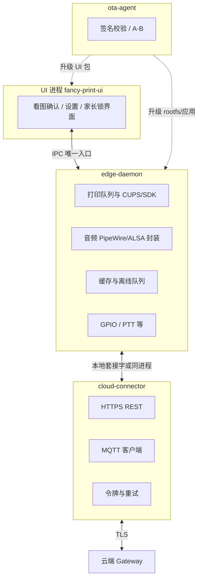
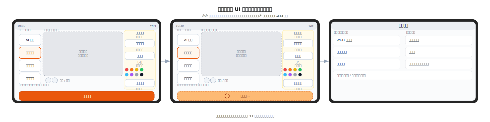
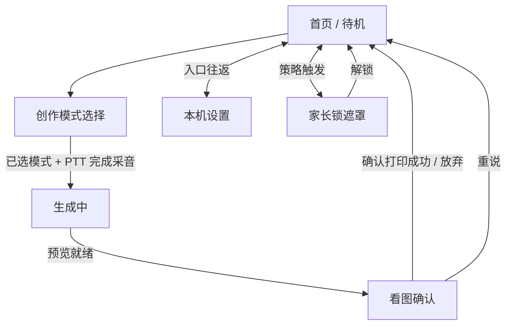
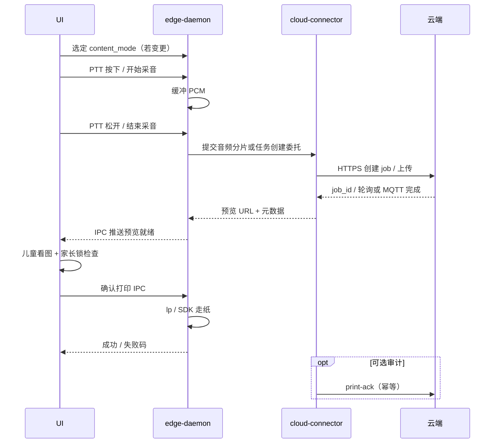

# 奇想印印（fancy-print）端侧设计

> **定位**：描述 **整机侧软件架构**（进程模型、IPC、与云端连接、打印抽象、安全与 OTA 要点），作为 **设计层导读**；并给出 **`fancy-print-ui` 功能列表** 与 **UI 设计图引用（线框 + 整机上下文）**（**§2.3～§2.4**）。**实现细节、镜像包清单、工程习惯、样机 BOM、渲染资产** 仍以 [`2. 端侧软件与工程样机技术分析.md`](2. 端侧软件与工程样机技术分析.md)（**Part A～C**）为权威长文。  
> **关联**：**端云总览图**见下节嵌入图（源 [`images/系统架构图.svg`](images/系统架构图.svg)）；云端见 [`4. 服务器端设计.md`](4. 服务器端设计.md)；家长手机见 [`5. 家长端应用设计.md`](5. 家长端应用设计.md)；场景与幅面见 [`0. 产品构想.md`](0. 产品构想.md#product-scenarios)。

---

## 总览图（端侧 + 云端）

---

## 1 目标与范围

### 1.1 端侧要解决的问题

| 能力 | 说明 |
|------|------|
| **儿童主交互** | 约 **6 寸横屏触屏** 看图确认、**PTT** 说话、本机 **家长锁**；在 **创作前** 选择 **内容模式**（如涂色 / 剪纸 / 换装等，与 PRD 枚举一致）；UI **不**直连 USB 打印字节流。 |
| **硬件与网络抽象** | 音频采集/播放、GPIO、打印队列、磁盘缓存、**弱网重试**；统一经 **`edge-daemon`** 暴露给 UI。 |
| **云上编排的客户端** | **`cloud-connector`** 负责 HTTPS/MQTT、令牌生命周期、背压；业务状态与 **`job_id`** 对齐云端（见 [`4. 服务器端设计.md`](4. 服务器端设计.md)）。 |
| **可升级与可运维** | **`ota-agent`** 签名包、A/B 或等价机制；**systemd** 托管、崩溃自拉起；日志可抓取且 **脱敏**。 |
| **与 PRD 一致的安全面** | 只读根、配置 overlay、与云端审核策略一致的 **端上闸门**（家长锁 + 打印确认）。 |

### 1.2 非目标

- **不在端侧默认跑完整文生图大模型**（算力与合规以云端为主路径）。  
- **不把业务规则写死在 UI 二进制内**；功能开关与策略以 **数据驱动**（见 [`2. 端侧软件与工程样机技术分析.md`](2. 端侧软件与工程样机技术分析.md) **§8**）。  
- **本文不展开工程样机 E1～E15 物料表**（见同文件 **§10**）**与 CMF 基准图流程**（**§11**）。

### 1.3 与云端、家长端的边界

| 维度 | 端侧 | 云端 | 家长 App |
|------|------|------|----------|
| **内容创作模式** | 孩子在 **本机 UI** 选择模式（或默认上次/策略默认）；**随 Job 上报** `content_mode`（命名以契约为准） | 模板、线稿/淡彩、生图参数与审核策略 **按模式编排** | 可限制 **可用模式子集** 或默认（若产品启用） |
| 看图确认与本地打印 | ✅ | 提供预览 URL / 任务状态 | 可选远程闸门（策略档位） |
| ASR / 生图 / 深度审核 | 上传音频、下载图 | ✅ | — |
| 设备身份 | `cloud-connector` 使用设备凭据 | 校验、编排 | 家长账号独立通道 |

---

## 2 逻辑架构

### 2.1 进程与职责

与 [`2. 端侧软件与工程样机技术分析.md`](2. 端侧软件与工程样机技术分析.md) **§4** 一致，推荐四块：**UI**、`edge-daemon`、`cloud-connector`（可与 daemon 同进程或拆分）、**ota-agent**。

**硬约束**：UI 进程崩溃 **不得** 丢失 daemon 内已接受的打印任务；daemon **无界面**、可独立 OTA（见 **§6**）。

### 2.2 systemd 与依赖顺序（逻辑）

| Unit / 目标 | 说明 |
|-------------|------|
| **网络就绪** | `cloud-connector` 依赖 **WiFi/以太网** 可用后再重连 MQTT。 |
| **音频子系统** | `edge-daemon` 在 **PipeWire/ALSA** 就绪后接管设备，避免与桌面争用。 |
| **打印栈** | CUPS / 厂商守护进程先于 **`edge-daemon`** 中打印逻辑 `Ready`。 |
| **UI 最后** | kiosk 或图形会话启动后再拉起 **UI**，避免无显示连接。 |

具体 unit 片段与产测入口见 [`2. 端侧软件与工程样机技术分析.md`](2. 端侧软件与工程样机技术分析.md) **§7**。

### 2.3 fancy-print-ui 功能列表

下列能力均由 **`fancy-print-ui`** 呈现；业务与硬件调用 **仅** 经 IPC 走 **`edge-daemon`** / **`cloud-connector`**（见 **§3**、**§4**）。与 [`0. 产品构想.md`](0. 产品构想.md)「约 6 寸触屏看图确认 + PTT」及 **内容形态（模式）**、[`5. 家长端应用设计.md`](5. 家长端应用设计.md) 策略档位一致。

| 功能 | 用户/产品目标 | 主要界面或状态 | 与端侧其他组件 |
|------|----------------|----------------|----------------|
| **首页 / 待机** | 孩子一眼可知「能不能说、能不能打」 | **横屏**：**左侧纵向入口**（如 AI 创作 / 涂色乐园 / 趣味模板 / 我的作品），**中央大预览**（随所选模式），**右侧工具栏与当前模式绑定**（示意：选「涂色乐园」时出现参考线稿、涂色笔、填色颜料、涂色橡皮等），**底栏主操作**（如确认打印）；**PTT 以机身物理键为主**（见整机基准渲染图）；顶栏时间、网络等状态 | 状态由 daemon 汇总；不直连云 |
| **创作模式选择** | 孩子先选「要做哪一类纸」（安静书涂色、剪纸、换装等，见 [`0. 产品构想.md`](0. 产品构想.md) **内容形态**）；降低 ASR 歧义、对齐云端模板 | **首页或 PTT 前** 大图标 / 横滑卡片；可选「上次模式」一键续用；**家长策略**可隐藏部分模式 | 选中值写入 **本机状态** 并经 IPC 随 **创建 Job** 上报 `content_mode`；云端编排见 [`4. 服务器端设计.md`](4. 服务器端设计.md) |
| **PTT 说话** | 按住说、松手结束；符合低幼操作 | 按下/松开动画与短提示音（若启用）；**当前模式**在采音区弱提示 | 采音起止 **仅 IPC** 到 daemon；**模式**与音频 / Job 创建绑定 |
| **生成中 / 排队** | 弱网可等待、可理解「还在干活」 | 进度或阶段文案；可选 **取消**（产品开关） | 任务与 `job_id` 与 connector 对齐 |
| **看图确认** | 全屏看清 **A5** 预览再决定 | **与主界面同一壳**：中央大预览不变，**底栏主按钮**在「确认打印 / 生成中…」等状态间切换（线框 **①②**） | 预览数据来自 daemon；**不**内嵌浏览器任意域 |
| **打印结果与设备态** | 成功鼓励；缺纸/卡纸/过热可行动 | 全屏或 toast + **儿童友好错误码** 映射 | 错误码与 [`4. 服务器端设计.md`](4. 服务器端设计.md) / 本地枚举对齐 |
| **家长锁** | 本机 PIN/图案等 **受控入口**；锁定时阻断创作/打印 | 全屏遮罩或独立页；与策略档位一致 | 校验与审计在 **daemon** 协同完成 |
| **本机设置** | WiFi、音量、亮度、关于、恢复出厂（受控） | **横屏双列**列表 + **底栏**返回/帮助（示意） | 敏感写操作经 IPC；恢复出厂策略见长文 |
| **首次引导 / 联网** | 开箱少摩擦（若产品保留） | 选 WiFi、展示绑定码等 | 与 connector 激活流配合 |

**路线图（端 UI 可选，不默认承诺 MVP）**：如「最近一张」缩略廊道、极简相册入口等，以 PRD 切段；若不做则仅云端 / 家长端承载。

### 2.4 UI 设计图

**说明**：下图为 **整机上下文** 与 **信息架构、关键屏线框**，用于研发对齐与 IPC 评审；**像素视觉稿、动效、品牌色与字体** 以设计交付为准（可放在独立设计仓库或 Figma，此处可链出「版本 + 日期」）。**整机外形与屏在机身上的位置** 亦见 [`0. 产品构想.md`](0. 产品构想.md) 内嵌整机基准图（与 [`2. 端侧软件与工程样机技术分析.md`](2. 端侧软件与工程样机技术分析.md#product-render-system) **§11** 一致）。

#### 硬件上下文（整机 + 屏位）

#### 关键屏线框（示意）

*线框源文件：[`images/端侧-ui-线框示意.svg`](images/端侧-ui-线框示意.svg)。整机为 **横屏约 16:9**（示意 **600×338** 逻辑单位）；**共三屏**：① 可打印主界面、② **同①** 仅底栏 **生成中** 状态、③ **本机设置**（双列 + 底栏）；①② 与 [`images/整机基准渲染图.png`](images/整机基准渲染图.png) 同壳；**右侧工具与左侧当前模式绑定**（示意为选中「涂色乐园」时的专用工具）；PTT 机身键示意。UTF-8 中文示意，与 Figma 对齐以设计交付为准。*

#### 界面关系（导航逻辑）

主路径仍以 **§4.2** 时序为准；上图仅表达 **UI 状态机导航**（含 **创作模式** 在 PTT 之前），不替代 IPC 字段定义。

---

## 3 IPC 契约（UI ↔ edge-daemon）

须在仓库内维护 **版本化** 的 **OpenAPI 或 protobuf**（[`2. 端侧软件与工程样机技术分析.md`](2. 端侧软件与工程样机技术分析.md) **§5.2**），至少覆盖：

| 能力域 | 要点 |
|--------|------|
| **创作模式** | 当前 `content_mode`（与云端枚举一致）、**是否允许切换**（策略锁）、默认来源（上次 / 策略 / 家长子集）。 |
| **预览** | 云端预览 URL、本地缩略图路径、过期时间；UI 只读展示。 |
| **打印任务** | `job_id`、**`content_mode`**、纸张 **A5**、色彩/线稿模式、优先级、超时与取消。 |
| **错误码** | 可映射儿童友好文案：网络、审核拒绝、缺纸、卡纸、过热等。 |
| **家长锁** | 查询状态；**受控写**（如 PIN 修改）须 daemon 侧校验与审计。 |

**原则**：UI **禁止**直接调用 `lp` 或写 USB 打印机节点；所有出纸请求经 IPC **单一入口**，便于权限收敛与 mock。

---

## 4 核心运行时流程

### 4.1 冷启动到可交互

1. 内核与 systemd 拉起 CUPS/音频栈。  
2. **`edge-daemon`** 恢复本地队列与缓存索引；连接 **IPC** 监听。  
3. **`cloud-connector`** 加载设备凭据、刷新令牌、订阅 MQTT。  
4. **UI** 启动全屏；读取 **本地策略版本** 与 **允许的创作模式列表**；若低于云端则拉取或等待推送（见 [`4. 服务器端设计.md`](4. 服务器端设计.md) **§3**）。  
5. 显示「可说话 / 网络不可用」等 **由 daemon 汇总的状态**；**创作模式** 显示为当前选中项（可默认上次）。

### 4.2 主路径：PTT → 云端成图 → 本机确认 → 打印

**家长锁**：若策略要求本机 PIN 或远程闸门，**确认打印** 前在 **D 或 U 与 D 协同** 完成校验；与 [`5. 家长端应用设计.md`](5. 家长端应用设计.md) **§3.3** 档位一致。

### 4.3 OTA（摘要）

- **`ota-agent`** 下载签名包 → 校验 → 切换分区或原子替换应用目录 → 重启依赖单元；失败 **回滚**（见 [`2. 端侧软件与工程样机技术分析.md`](2. 端侧软件与工程样机技术分析.md) **§7.6** 与同文安全章节）。  
- **UI 与 daemon 可分包升级**；IPC **主版本** 不兼容时须在镜像元数据中 **声明依赖**，避免半升级状态。

---

## 5 数据、缓存与配置

| 类别 | 建议 |
|------|------|
| **缓存目录** | 仅 **`edge-daemon`** 可写；配额与 LRU 清理；含预览图与临时音频分片。 |
| **配置 overlay** | 只读根之上的 **可写层** 存本机策略、WiFi 凭据（加密）、家长锁状态指针。 |
| **密钥** | 设备云凭据 **每机注入** 或安全元件；**禁止**硬编码进只读镜像（见 [`2. 端侧软件与工程样机技术分析.md`](2. 端侧软件与工程样机技术分析.md) **§8**）。 |

---

## 6 安全与可靠性（端上摘要）

| 主题 | 要求 |
|------|------|
| **TLS** | `cloud-connector` 固定证书链；是否 **证书钉扎** 随威胁模型（同《端侧软件与工程样机技术分析》）。 |
| **内容安全** | 与云端 **错误码** 对齐；儿童侧文案 **不泄露** 审核敏感细节。 |
| **看门狗** | 对 **`edge-daemon`** 强约束（**WatchdogSec=** 或业务心跳）；UI 可软重启。 |
| **日志** | 支持售后一键抓取；**默认不落** 完整语音明文。 |

---

## 7 测试与交付物（与实现联动）

与 [`2. 端侧软件与工程样机技术分析.md`](2. 端侧软件与工程样机技术分析.md) **§9** 对齐，阶段交付至少包括：**可刷镜像**、**daemon + UI + systemd unit**、**IPC 契约与错误码表**、**manifest 片段**、运维说明。场景测试须覆盖：**断网 / 弱网 / 云端 429/5xx / 审核拒绝 / 缺纸卡纸**。

---

## 8 文档与实现对照表

| 主题 | 本文 | 长文位置 |
|------|------|----------|
| 背景与路线一致 | §1 | [`2. 端侧软件与工程样机技术分析.md`](2. 端侧软件与工程样机技术分析.md) **§1～2** |
| fancy-print-ui 功能列表 | §2.3 | 含 **创作模式**；与 **§4**、[`0. 产品构想.md`](0. 产品构想.md) 内容形态一致 |
| UI 线框与设计图引用 | §2.4 | 线框 SVG、整机上下文图；视觉 CMF / 换壳见 **§11**；UI 框架选型 **§5.1** |
| OS 基线与 manifest | — | **§3、§3.2** |
| IPC 字段级列举 | §3 | **§5.2**；含 `content_mode` / Job 参数 |
| 打印 / 音频 / 触屏 | — | **§6** |
| Remote-SSH、镜像收口、OTA 细节 | §4.3 | [`2. 端侧软件与工程样机技术分析.md`](2. 端侧软件与工程样机技术分析.md) **§7、§7.6** |
| 安全与隐私配置 | §6 | **§8** |
| 测试清单 | §7 | **§9** |
| 样机 BOM / 屏规格 | — | **§10** |
| 机身基准与换壳 | — | **§11** |

---

## 9 关联文档

| 文档 | 用途 |
|------|------|
| [`2. 端侧软件与工程样机技术分析.md`](2. 端侧软件与工程样机技术分析.md) | 端侧 **完整**技术分析（OS～测试～BOM～渲染） |
| [`images/系统架构图.svg`](images/系统架构图.svg) | 端云一张图（嵌入见本文 **「总览图」** 节） |
| [`images/端侧-ui-线框示意.svg`](images/端侧-ui-线框示意.svg) | fancy-print-ui 关键屏线框（嵌入见 **§2.4**） |
| [`4. 服务器端设计.md`](4. 服务器端设计.md) | 云端 API/MQTT、Job、策略 |
| [`5. 家长端应用设计.md`](5. 家长端应用设计.md) | 家长 App、策略档位 |
| [`0. 产品构想.md`](0. 产品构想.md) | PRD 场景与 A5/ZINK 要点 |

---

**维护说明**：若变更 **进程边界**（例如 connector 与 daemon 合并/拆分）或 **IPC 主版本**，须同步更新本文件、[`images/系统架构图.svg`](images/系统架构图.svg) 与 **OpenAPI/proto** 仓库。若 **主路径屏数量或导航结构** 变更，须同步更新 **§2.3** 功能表、**§2.4** Mermaid 与 [`images/端侧-ui-线框示意.svg`](images/端侧-ui-线框示意.svg)。
