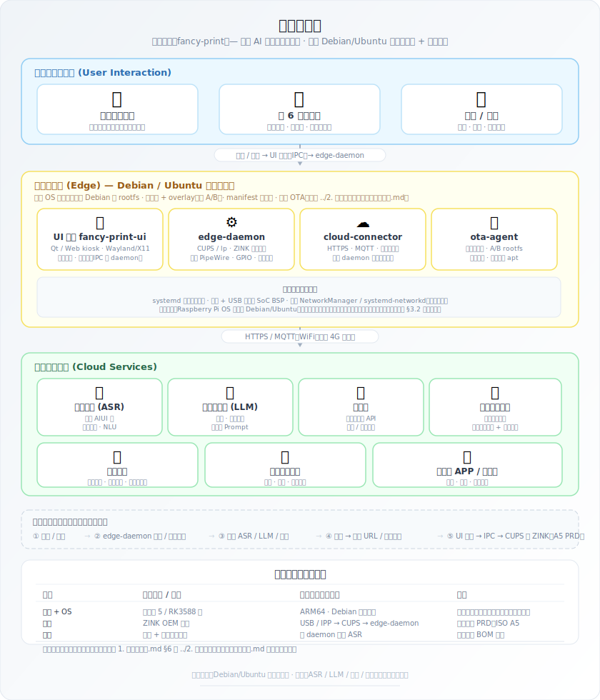
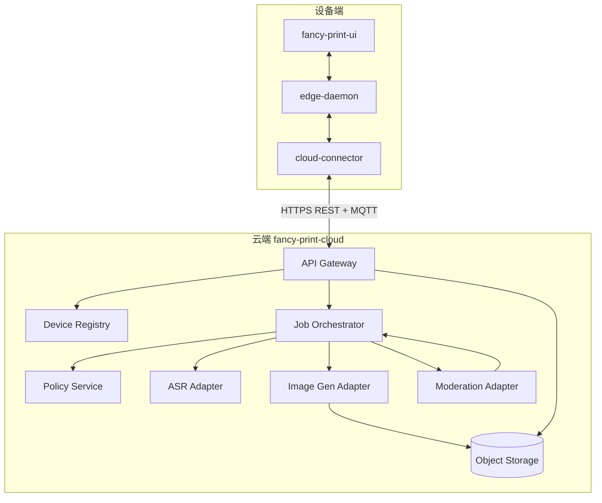

# 奇想印印（fancy-print）服务器端设计

> **定位**：描述 **设备经 `cloud-connector` 访问的云端能力** 的逻辑架构、服务边界、协议与安全原则；并给出 **云端功能列表** 与 **HTTP/MQTT API 一览**（**§2.3～§2.4**），与仓库 [`contracts/openapi/`](../contracts/openapi/) 及 MQTT 约定对齐演进。**不替代** [`0. 产品构想.md`](0. 产品构想.md) / [`1. 项目计划书.md`](1. 项目计划书.md) 中的商业与 PRD 细节。端侧软件分层、进程与主流程见 [`3. 端侧设计.md`](3. 端侧设计.md)；OS 细节、清单、外设与样机硬件见 [`2. 端侧软件与工程样机技术分析.md`](2. 端侧软件与工程样机技术分析.md) **§1～§11**；**端云总览图**见下节嵌入图（源文件 [`images/系统架构图.svg`](images/系统架构图.svg)）。

---

## 总览图（端侧 + 云端）

## 1 目标与范围

### 1.1 云端要解决的问题

| 能力 | 说明 |
|------|------|
| **ASR / NLU** | 将儿童语音转为可控的文本意图；复杂理解与澄清话术宜在云端完成（端上算力与模型体积受限）。 |
| **文生图编排** | 调用可替换供应商的生图 API；**A5 画布** 出稿、线稿/淡彩等 **内容策略** 由云端模板与策略版本驱动。 |
| **内容安全** | Prompt 与 **成图** 的多层审核（与计划书中的「黑名单 + 模型输出过滤 + 图像审核 API」一致）；**拦截原因码** 需端上可映射为儿童友好文案。 |
| **会话与任务** | 为每次「说 → 生成 → 屏上确认 → 打印」维护 **幂等任务 ID**、状态机与超时；支撑弱网重试与审计。 |
| **设备与家长策略** | 设备身份、固件/策略版本、家长锁与配额（若产品启用）；策略 **可 MQTT 推送 / HTTPS 拉取**。 |
| **可选增值** | 成长相册、多孩档案、存储扩容等（路线图）；MVP 可先 **不落库** 或仅最小审计日志。 |

### 1.2 非目标（首版可明确排除）

- **不在云端直接驱动打印机**；打印仅发生在端上 `edge-daemon` → CUPS/SDK（见端侧文档）。  
- **不把完整大模型权重部署在通用云端路径上**作为默认方案（成本与合规单独评估）；默认以 **供应商 API** 为主。  
- **不绑定单一云厂商**；接口层保留 **Adapter** 以便替换 ASR / 生图 / 图审供应商。

### 1.3 与端侧的职责边界（摘要）

与 [`2. 端侧软件与工程样机技术分析.md`](2. 端侧软件与工程样机技术分析.md) **§2.2** 对齐：

| 维度 | 端上 | 云端 |
|------|------|------|
| 交互与管控 | 触屏看图确认、家长锁、本地缓存、调用打印 / 音频 | ASR、文生图编排、审核、家长与内容策略 |
| 实现约束 | UI 经 IPC 调 `edge-daemon`；不直连 USB 打印字节流 | 经 **HTTPS / MQTT** 与 `cloud-connector` 对话 |
| 运行与升级 | 只读根 + OTA | 独立发布周期；**配置与策略** 可热更新 |

---

## 2 逻辑架构

### 2.1 组件一览

云端按 **可独立伸缩的服务** 划分（实现上可为 **单体 + 清晰模块** 起步，再拆分）。

| 逻辑服务 | 职责 |
|----------|------|
| **API Gateway** | TLS 终结、限流、**设备鉴权**（见 §5）、请求路由、审计头注入。 |
| **Device Registry** | 设备 ID、证书/密钥指纹、固件版本、策略版本、启用能力标志。 |
| **Session / Job Orchestrator** | 「一次创作任务」状态机：已创建 → ASR 完成 → 审核通过 → 生图中 → 图审通过 → **可下载** / 失败终态；**幂等键** 与超时（可与计划书 **15s 级切换备用 API** 策略对齐）。 |
| **Policy & Config** | 黑名单版本、生图模板、线稿模式开关、年龄段策略；对设备 **MQTT 下发** 或 **HTTPS 拉取**。 |
| **ASR Adapter** | 流式或分片上传音频 → 供应商 ASR；返回文本与置信度。 |
| **Image Gen Adapter** | 主备供应商路由、超时重试、**成本标签** 打点；输出 **带过期时间的对象存储 URL** 或经 Gateway **签名重定向**。 |
| **Moderation Adapter** | Prompt 审核 + **成图审核**（阿里云内容安全 / 腾讯天御等可插拔）；统一 **拒绝码**。 |
| **TTS / 提示策略（可选）** | 云端生成简短语音反馈 URL，或仅返回文本由端上 TTS（产品二选一）。 |
| **Object Storage** | 存中间图、缩略图；**生命周期**（如 7～30 天）与 **仅 HTTPS 下载**。 |
| **Observability** | 指标、分布式追踪、**脱敏审计日志**（见 §6）。 |

### 2.2 架构示意（Mermaid）

与上图 **「三、云端服务」** 块一致：ASR、生图、深度审核为云端能力；**编排与鉴权** 归属本仓库所述 **自有后端**（非仅「透传第三方」）。

### 2.3 云端功能列表

下表从 **对外能力** 归纳（与 **§2.1 组件**、**§4 流程**、**§8 MVP** 对照）；实现上可 **单体多模块** 起步，再按行拆服务。

| 功能 | 说明 | 主要逻辑服务 | MVP / 增强 |
|------|------|--------------|-------------|
| **设备注册与令牌** | 首次激活、刷新、吊销；与 Device Registry 对齐 | Gateway、Device Registry | MVP |
| **创作任务（Job）** | 创建、查询状态、终态；幂等与超时 | Job Orchestrator、Gateway | MVP |
| **音频上云与 ASR** | 分片或流式上传 → 转写 | ASR Adapter、Object Storage（若落临时文件） | MVP |
| **意图与 Prompt 审核** | 文本侧拦截、统一拒绝码 | Moderation Adapter、Policy | MVP |
| **文生图编排** | 模板、A5 参数、主备切换 | Image Gen Adapter、Policy | MVP |
| **成图审核** | 出图后图审、写回 Job | Moderation Adapter、Object Storage | MVP |
| **预览与下载 URL** | 短期 HTTPS、TTL；不写死端上路径 | Job Orchestrator、Object Storage、Gateway 签名跳转 | MVP |
| **任务完成通知** | 降延迟推送状态 | MQTT（或长轮询兜底） | 增强优先；MVP 可轮询 |
| **策略下发与版本** | 档位、限额、黑名单版本等 | Policy、MQTT / GET policy | MVP（HTTPS 拉取为主） |
| **打印审计（可选）** | 端上确认出纸后的幂等 ack | Gateway、Job Orchestrator | MVP 可选 |
| **家长账号与 BFF** | 与设备通道隔离的 HTTPS 面 | Gateway（路由至 parent-bff）、Policy、Job | 增强（MVP 可仅设备） |
| **远程批准打印** | 档位 B：approve/reject、MQTT 联动 | parent-bff、Policy、Job、MQTT | 增强 |
| **相册与对象生命周期** | 缩略图、归档、过期删除 | Object Storage、（相册服务） | 路线图 |
| **可观测与审计** | trace、指标、脱敏日志 | Observability 横切 | MVP 基础 |

### 2.4 API 与契约总览

**单一事实来源**：字段级 **OpenAPI**、**MQTT AsyncAPI/Schema** 放在仓库 [`contracts/`](../contracts/)（`openapi/`、`mqtt/`）；下表为 **稳定路径与职责索引**，变更时须同步契约文件与本节。

#### 2.4.1 设备通道（HTTPS，`cloud-connector` → Gateway / `device-api`）

**前缀**：`/v1`；**鉴权**：设备 mTLS 或 `Authorization: Bearer <device_access_token>`（见 **§5**）。**通用头**：`Idempotency-Key`（见 **§3.1**）用于易重复提交的 `POST`。

| 方法 | 路径 | 职责 | 幂等 / 备注 |
|------|------|------|----------------|
| `POST` | `/v1/devices/sessions` 或 `/v1/auth/device` | 设备激活后换发访问令牌、刷新令牌（命名以 OpenAPI 为准） | 按注册协议 |
| `POST` | `/v1/auth/token` | 刷新设备访问令牌 | 常用 refresh 体 |
| `POST` | `/v1/jobs` | 创建创作任务，返回 `job_id`；请求体含 **`content_mode`**（与端侧 PRD 枚举一致，见 [`3. 端侧设计.md`](3. 端侧设计.md) **§2.3**） | **必须**支持 `Idempotency-Key` |
| `GET` | `/v1/jobs/{job_id}` | 查询状态、预览 URL、错误码、策略版本指针 | 只读 |
| `POST` | `/v1/jobs/{job_id}/audio` 或 `.../chunks` | 上传采音分片（或单次整段，由 PRD 定大小上限） | 可分片序号 + Job 绑定 |
| `GET` | `/v1/policy` 或 `/v1/devices/{device_id}/policy` | 拉取当前策略 JSON / 版本号 | 配合 `If-None-Match` 可选 |
| `POST` | `/v1/jobs/{job_id}/print-ack` | 端上已确认出纸的审计打点（可选） | **必须**幂等 |
| `GET` | `/v1/jobs/{job_id}/artifact` | 302/JSON 返回带 TTL 的预览地址（若与 GET job 拆分） | 短 TTL |

与 **§4.1** 步骤编号对应：`POST /v1/jobs` → 上传音频 → 轮询或 MQTT 直至 `GET /v1/jobs/{id}` 为可下载态。

#### 2.4.2 家长 BFF（HTTPS，家长 App → `parent-bff`）

**前缀**：`/v1/parent`（与设备路径 **隔离**）；**鉴权**：家长 OIDC / 短期 JWT + refresh，敏感写操作 **二次验证**（见 [`5. 家长端应用设计.md`](5. 家长端应用设计.md) **§6**）。

| 方法 | 路径（示例） | 职责 | 备注 |
|------|----------------|------|------|
| `GET` | `/v1/parent/me` | 当前家长资料 | — |
| `GET` | `/v1/parent/households/{household_id}/devices` | 家庭下设备列表与在线摘要 | — |
| `POST` | `/v1/parent/households/{household_id}/devices/bind` | 扫码 / 短码完成绑定 | 幂等 |
| `POST` | `/v1/parent/households/{household_id}/devices/{device_id}/unbind` | 解绑 | 强鉴权 |
| `GET` | `/v1/parent/households/{household_id}/policy` | 读取策略档位、限额等 | — |
| `PATCH` | `/v1/parent/households/{household_id}/policy` | 更新策略；下发 MQTT | 版本冲突返回 409 |
| `GET` | `/v1/parent/households/{household_id}/jobs` | 动态时间线（缩略、分页） | 最小必要字段 |
| `GET` | `/v1/parent/households/{household_id}/jobs/pending-approvals` | 档位 B 待审批列表 | 增强 |
| `POST` | `/v1/parent/households/{household_id}/jobs/{job_id}/approve` | 远程批准 | **幂等**；与 **§4.3** 一致 |
| `POST` | `/v1/parent/households/{household_id}/jobs/{job_id}/reject` | 远程拒绝 | **幂等** |

具体字段、错误体与分页参数以 **OpenAPI** 为准；**不与设备 mTLS 身份混用**。

#### 2.4.3 MQTT（订阅 / 发布索引）

与 **§3.2** 一致；实现时写入 [`contracts/mqtt/`](../contracts/mqtt/)。

| 方向 | Topic 模式（示例） | 载荷要点 |
|------|-------------------|----------|
| 云 → 设备 | `devices/{device_id}/jobs/{job_id}/status` | `state`、`preview_url_ttl`、`error_code` |
| 云 → 设备 | `devices/{device_id}/policy` | `version`、`hash`、`apply_after` |
| 设备 → 云 | `devices/{device_id}/telemetry` | 脱敏心跳、固件版本等 |

---

## 3 通信与协议

### 3.1 HTTPS（REST / JSON）

**典型用途**：注册与刷新令牌、创建任务、上传音频分片、查询任务状态、拉取策略 JSON、拉取 **预览图 / 成图** 的短期 URL。**HTTP 路径与职责索引**见 **§2.4.1、§2.4.2**。

**约定**：

- **版本化路径**：如 `/v1/...`，破坏性变更递增主版本。  
- **设备身份**：每个请求带 **设备证书或访问令牌**（见 §5）。  
- **幂等**：`POST /v1/jobs` 支持 `Idempotency-Key` 头，避免弱网重复创建。  
- **错误体**：机器可读 `code` + 人类可读 `message`；`code` 与端侧 IPC **错误码表** 可映射（见端侧 **OpenAPI/proto** 要求）。

### 3.2 MQTT

**典型用途**：任务完成通知、策略更新、**运营广播**（维护窗口）、可选的实时进度（生图队列）。

**主题命名建议**（示例，实现时写入 OpenAPI/MQTT 规范文档）；**与 API 总览对照**见 **§2.4.3** 与 [`contracts/mqtt/`](../contracts/mqtt/)。

| 方向 | Topic 模式 | 载荷要点 |
|------|------------|----------|
| 云 → 设备 | `devices/{device_id}/jobs/{job_id}/status` | `state`, `preview_url_ttl`, `error_code` |
| 云 → 设备 | `devices/{device_id}/policy` | `version`, `hash`, `apply_after` |
| 设备 → 云 | `devices/{device_id}/telemetry` | **脱敏** 心跳、固件版本、信号强度（避免儿音原文） |

**QoS**：任务状态建议 **QoS 1**；策略全量可 **QoS 1 + 设备 ACK 后本地持久化**。

### 3.3 与端侧契约

- 仓库内应维护 **云端 HTTP + MQTT 的 OpenAPI / AsyncAPI**（或与端侧 **同一 proto 仓库** 生成两端 stub）；**路径与 Topic 索引**见 **§2.4**。  
- **`cloud-connector`** 只实现 **网络、重试、背压、令牌刷新**；业务状态机以 **Job 资源** 为中心，与 **Orchestrator** 对齐。

---

## 4 核心业务流程

### 4.1 主路径：语音 → 成图 → 待打印预览

与 [`1. 项目计划书.md`](1. 项目计划书.md) **§5.7** 主数据流一致，云端侧步骤细化如下：

1. **connector** `POST /v1/jobs`，携带 `device_id`、**`content_mode`**（端侧所选创作模式）、可选 `child_profile_id`（若产品启用多孩）、**幂等键**。  
2. **Orchestrator** 创建 `job`，返回 `job_id`。  
3. 音频：**分片上传** 或流式通道（HTTP/2、gRPC 或供应商直连由 Adapter 封装）；**ASR Adapter** 产出 `transcript`。  
4. **Moderation**：对 `transcript` 与 **意图分类结果** 过策略；不通过则 **终态 rejected**，`code` 供端上播报。  
5. **Image Gen Adapter**：带模板与 **A5 安全边距** 参数调用主供应商；超时则按产品策略 **切换备用**（见计划书多 API 表）。  
6. **成图审核**：通过后写入 **Object Storage**，生成 **HTTPS 短期 URL** 写回 `job`；经 MQTT 或轮询告知设备。  
7. 设备 **UI 看图确认** 后仅本地走 IPC 打印；云端可收 **`POST /v1/jobs/{id}/print-ack`**（可选）用于 **审计与计费**，须 **幂等**。

### 4.2 失败与降级

| 场景 | 云端行为 | 端上配合 |
|------|----------|----------|
| 主生图超时 | 切换备用 Adapter；仍失败则 `job` failed + 可重试标记 | TTS 安抚 + 重试按钮（计划书） |
| 全供应商不可用 | 返回明确 `code`：`CLOUD_DEGRADED` | 端上 **预设图包** 随机（计划书离线降级） |
| 审核拒绝 | `code` 区分 prompt / image；不泄露审核细节给儿童文案 | 引导换说法或联系家长 |

### 4.3 家长授权与敏感操作

- **「打印已确认」** 的语义以 **端上家长锁 + UI 动作为准**；云端 **不信任** 未鉴权客户端声称的「已家长同意」。  
- **家长 App** 的档位（机身自主 / 远程闸门 / 信任时段）、导航与 BFF 边界见 **[`5. 家长端应用设计.md`](5. 家长端应用设计.md)**；远程批准须走 **家长强鉴权 + 幂等 API**，并与 **Policy / MQTT** 联动。  
- 家长账号 **OIDC / 短信验证** 等具体 IdP 选型在 App 与网关落地，随 **`/v1/parent/...`** 契约演进。

---

## 5 安全与身份

### 5.1 设备身份（量产）

推荐优先级（可并存）：

1. **每机密钥 + 证书**（工厂烧录或安全元件）；`cloud-connector` 使用 **mTLS** 或 **JWT（短期）+ 刷新令牌**。  
2. **首次配网注册**：交换设备公钥与 **批次证书**；云端 **Device Registry** 记录 `serial` ↔ `device_id`。  

**禁止**：把长期云密钥硬编码进 rootfs（与端侧安全要求一致）。

### 5.2 传输与存储

- 全链路 **TLS 1.2+**；对象存储 URL **短 TTL + 签名**；内部服务间 **mTLS** 或私有网络。  
- 日志中 **默认不记录** 儿童语音原文；必要时 **加密存证** 且访问 **双人授权**（合规另评）。

### 5.3 儿童内容与合规

- 审核策略与 **年龄段**、地域法规变更 **版本化**；回滚可复现。  
- **数据留存周期** 与 **删除权** 在产品隐私政策中定义；技术侧实现 **软删除 + 定时物理清除**。

---

## 6 可观测性与运维

| 类别 | 要求 |
|------|------|
| **指标** | 按 `device_id` 聚合的 QPS、延迟分位、供应商错误率、**单任务成本**（生图调用次数）。 |
| **追踪** | `job_id` 贯穿 Gateway → Orchestrator → Adapters；便于定位「哪一跳超时」。 |
| **审计** | 设备鉴权失败、策略变更、人工干预（如有审核台）**不可篡改追加日志**。 |
| **发布** | 云端 **蓝绿 / 金丝雀**；**策略配置** 与 **代码** 分开发布；重大变更兼容 **旧固件** 至少 N 个版本。 |

---

## 7 部署与环境

- **运行环境**：容器化（如 Kubernetes）或托管容器；**有状态组件**（Registry DB、消息队列、Redis 限流）与 **无状态 API** 分离。  
- **环境划分**：`dev` / `staging` / `prod`；**staging** 使用供应商 **沙箱密钥**，禁止与产线共用桶。  
- **密钥管理**：云 KMS / 托管密钥；Adapter 凭据 **按环境注入**，不进镜像。

---

## 8 MVP 与路线图

| 阶段 | 云端交付 |
|------|----------|
| **MVP** | Gateway + Job + ASR/生图/图审 **各一主供应商** + Object Storage + 基础指标与审计。 |
| **增强** | MQTT 全量、主备生图自动切换、Policy 热更新、计费打点。 |
| **家长与增值** | 家长账号、相册同步、存储套餐（见计划书增值方向）。 |

---

## 9 关联文档

| 文档 | 用途 |
|------|------|
| [`3. 端侧设计.md`](3. 端侧设计.md) | **端侧整机软件**：进程、IPC、主流程、OTA 与安全导读 |
| [`2. 端侧软件与工程样机技术分析.md`](2. 端侧软件与工程样机技术分析.md) | 端侧 **完整**技术分析（OS、工程、安全、测试、**§10 BOM**、**§11 渲染**） |
| [`images/系统架构图.svg`](images/系统架构图.svg) | 端云一张图（嵌入见本文 **「总览图」** 节） |
| [`0. 产品构想.md`](0. 产品构想.md) | 场景与 PRD 要点 |
| [`1. 项目计划书.md`](1. 项目计划书.md) | SoC、BOM、端侧模块、主数据流、多 API 降级、安全与 Phase A/B |
| [`contracts/`](../contracts/) | **OpenAPI / MQTT** 契约；与 **§2.4** 同步 |

---

**维护说明**：新增或变更 **HTTP 路径、MQTT 主题、错误码** 时，须同步 **§2.4**、仓库 [`contracts/`](../contracts/) 与 **端侧 OpenAPI/proto**；架构图若增删云端块，请更新 [`images/系统架构图.svg`](images/系统架构图.svg)。
