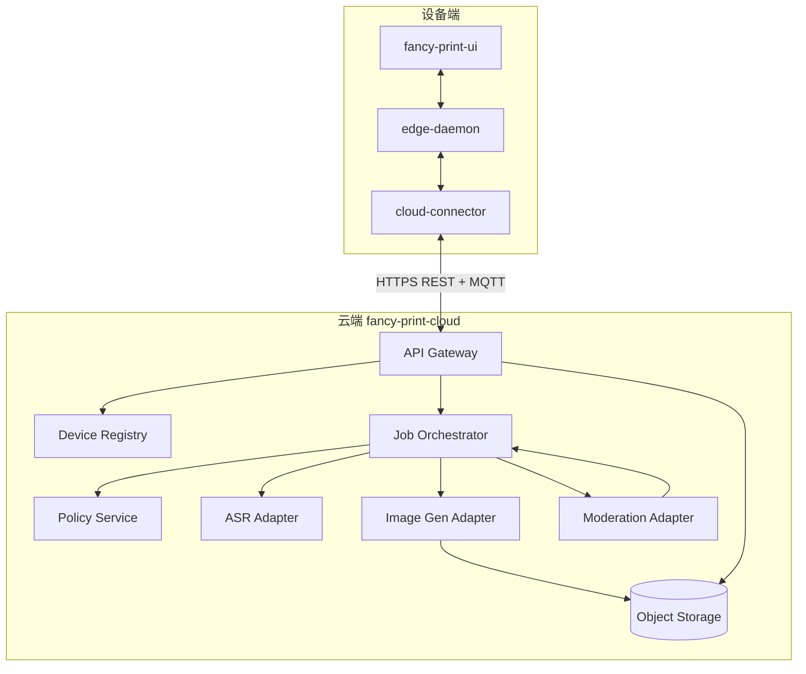
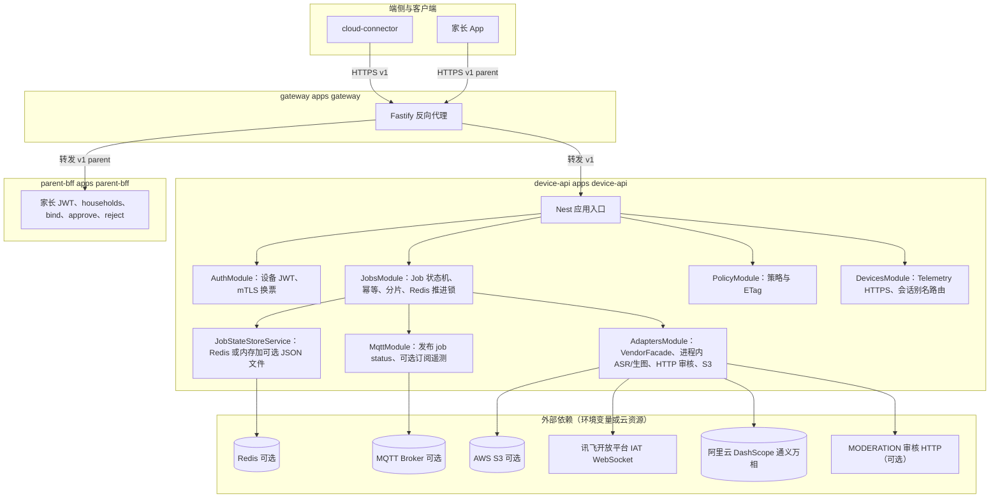
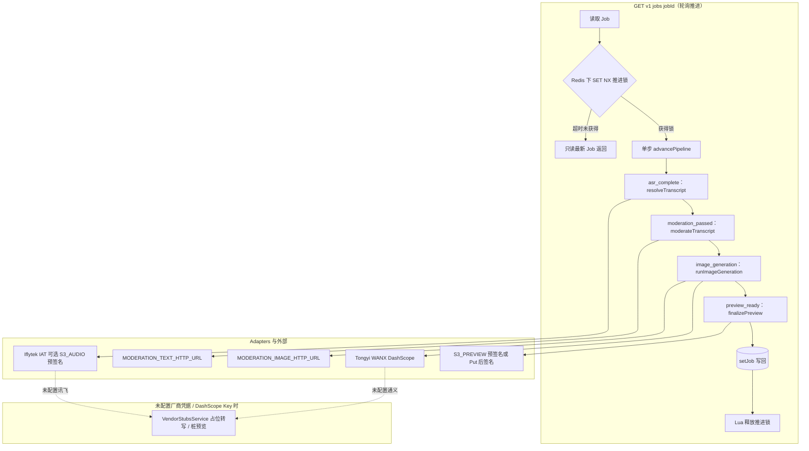

# 奇想印印（fancy-print）服务器端设计

> **定位**：描述 **设备经 `cloud-connector` 访问的云端能力** 的逻辑架构、服务边界、协议与安全原则；并给出 **云端功能列表** 与 **HTTP/MQTT API 一览**（**§2.3～§2.4**），与仓库 [`contracts/openapi/`](../contracts/openapi/) 及 MQTT 约定对齐演进。**仓库 `cloud/` 细化部署与模块映射**见 **§2.2.1**；**ASR / 文生图 / 审核** 的环境变量、驱动与扩展方式见 **§2.2.2**（与 `device-api` 中 `adapters/vendors/`、`vendor-adapter.factory.ts` 对齐）。**不替代** [`0. 产品构想.md`](0. 产品构想.md) / [`1. 项目计划书.md`](1. 项目计划书.md) 中的商业与 PRD 细节。端侧软件分层、进程与主流程见 [`3. 端侧设计.md`](3. 端侧设计.md)；OS 细节、清单、外设与样机硬件见 [`2. 端侧软件与工程样机技术分析.md`](2. 端侧软件与工程样机技术分析.md) **§1～§11**；**端云总览图**见下节嵌入图（源文件 [`images/系统架构图.svg`](images/系统架构图.svg)）。

---

## 总览图（端侧 + 云端）

## 1 目标与范围

### 1.1 云端要解决的问题

| 能力 | 说明 |
|------|------|
| **ASR / NLU** | 将儿童语音转为可控的文本意图（**当前实现**：`device-api` 内 **`AsrAdapter` → 讯飞 IAT WebSocket**，见 **§2.2.2**）；复杂理解与澄清话术宜在云端完成（端上算力与模型体积受限）。 |
| **文生图编排** | 由 `device-api` 内 **ImageGenAdapter** 调用供应商文生图 API（当前实现：**通义万相 / DashScope**）；**A5 画布** 与线稿/淡彩等 **内容策略** 由策略与模板版本驱动（与 Policy 对齐）。 |
| **内容安全** | **文本 / 成图审核**：可选 **`MODERATION_*_HTTP_URL`** 走固定 JSON 上游；未配置时编排层默认放行。与计划书中「黑名单 + 模型输出过滤 + 图像审核 API」一致方向；**拦截原因码** 需端上可映射为儿童友好文案。 |
| **会话与任务** | 为每次「说 → 生成 → 屏上确认 → 打印」维护 **幂等任务 ID**、状态机与超时；支撑弱网重试与审计。 |
| **设备与家长策略** | 设备身份、固件/策略版本、家长锁与配额（若产品启用）；策略 **可 MQTT 推送 / HTTPS 拉取**。 |
| **可选增值** | 成长相册、多孩档案、存储扩容等（路线图）；MVP 可先 **不落库** 或仅最小审计日志。 |

### 1.2 非目标（首版可明确排除）

- **不在云端直接驱动打印机**；打印仅发生在端上 `edge-daemon` → CUPS/SDK（见端侧文档）。  
- **不把完整大模型权重部署在通用云端路径上**作为默认方案（成本与合规单独评估）；默认以 **供应商 API**（进程内 Adapter 直连或审核 HTTP）为主。  
- **不绑定单一云厂商**：ASR / 文生图在代码中通过 **`AsrAdapter` / `ImageGenAdapter`** 扩展；审核仍可按 **`MODERATION_*_HTTP_URL`** 对接不同云安全产品。

### 1.3 与端侧的职责边界（摘要）

与 [`2. 端侧软件与工程样机技术分析.md`](2. 端侧软件与工程样机技术分析.md) **§2.2** 对齐：

| 维度 | 端上 | 云端 |
|------|------|------|
| 交互与管控 | 触屏看图确认、家长锁、本地缓存、调用打印 / 音频 | ASR、文生图编排、审核、家长与内容策略 |
| 实现约束 | UI 经 IPC 调 `edge-daemon`；不直连 USB 打印字节流 | 经 **HTTPS / MQTT** 与 `cloud-connector` 对话 |
| 运行与升级 | 只读根 + OTA | 独立发布周期；**配置与策略** 可热更新 |

---

## 2 逻辑架构

### 2.1 组件一览

云端按 **可独立伸缩的服务** 划分（实现上可为 **单体 + 清晰模块** 起步，再拆分）。

| 逻辑服务 | 职责 |
|----------|------|
| **API Gateway** | TLS 终结、限流、**设备鉴权**（见 §5）、请求路由、审计头注入。 |
| **Device Registry** | 设备 ID、证书/密钥指纹、固件版本、策略版本、启用能力标志。 |
| **Session / Job Orchestrator** | 「一次创作任务」状态机：已创建 → ASR 完成 → 审核通过 → 生图中 → 图审通过 → **可下载** / 失败终态；**幂等键** 与超时。量产可与计划书 **多供应商降级** 对齐；**当前仓库** ASR/生图为 **进程内单通路 + 未配置时桩**（见 **§2.2.2**）。 |
| **Policy & Config** | 黑名单版本、生图模板、线稿模式开关、年龄段策略；对设备 **MQTT 下发** 或 **HTTPS 拉取**。 |
| **ASR Adapter** | 分片或整段上传音频 → **进程内** ASR（讯飞 IAT）；返回 `transcript`（未配置凭据时桩）。 |
| **Image Gen Adapter** | **进程内** 文生图（通义万相 / DashScope）；超时与重试策略可演进；输出 **URL 或 base64**，预览可经 **S3 Put + 预签名**。量产可扩展 **主备或多模型路由**；当前见 **§2.2.2**。 |
| **Moderation Adapter** | **文本**：`transcript` → 可选 **`MODERATION_TEXT_HTTP_URL`**（`VendorHttpService` 固定 JSON）。**成图**：可选 **`MODERATION_IMAGE_HTTP_URL`**。统一 **拒绝码**；未配置 URL 时对应步骤默认放行。 |
| **TTS / 提示策略（可选）** | 云端生成简短语音反馈 URL，或仅返回文本由端上 TTS（产品二选一）。 |
| **Object Storage** | 存中间图、缩略图；**生命周期**（如 7～30 天）与 **仅 HTTPS 下载**。 |
| **Observability** | 指标、分布式追踪、**脱敏审计日志**（见 §6）。 |

### 2.2 架构示意（Mermaid）

与上图 **「三、云端服务」** 块一致：ASR、生图、深度审核为云端能力；**编排与鉴权** 归属本仓库所述 **自有后端**（非仅「透传第三方」）。**本仓库实现**中，**ASR / 文生图** 逻辑运行在 **`device-api` 进程** 内（`JobsModule` → `VendorFacadeService` → `AsrAdapter` / `ImageGenAdapter`），经公网直连 **讯飞 / 阿里云**；**审核** 可选经 **`MODERATION_*_HTTP_URL`** 调用第三方 HTTP。

### 2.2.1 仓库 `cloud/` 服务器端架构（细化）

本节在 **§2.2 逻辑组件图** 之上，按 **本仓库实际进程与目录** 展开，便于研发对齐部署与排障；字段级契约仍以 [`contracts/`](../contracts/) 为准。

#### 部署拓扑（进程与流量）

**说明**：`gateway` 可配置 **进程内 HTTPS+mTLS** 与 **证书序列号到 device_id 映射**，经头 **`x-device-id-from-mtls`** 转发至 `device-api`；生产亦可由 Ingress 终结 TLS（见 [`cloud/docs/ingress-mtls.md`](../cloud/docs/ingress-mtls.md)）。

#### `device-api` 内：Job 与供应商编排（数据流）

**注**：单次 **`GET /v1/jobs/{id}`** 仅 **推进一个状态档**；设备需 **多轮轮询** 直至 `preview_ready`。下图按 **阶段语义** 串联各档所调模块（非单次请求内顺序执行全部档）。

**说明**：多副本时 **幂等创建** 与 **Job 正文** 存 **Redis**（或单机内存 + `JOBS_PERSISTENCE_PATH`）；**冷导入 / 关机 SCAN 导出** 见 **§2.4.1** 实现注记；**遥测 NDJSON** 见 `DEVICE_TELEMETRY_LOG_PATH`。

#### 逻辑组件与 `cloud/` 实现映射

| §2.1 逻辑服务 | 本仓库主要落点 | 备注 |
|---------------|----------------|------|
| **API Gateway** | [`cloud/apps/gateway`](../cloud/apps/gateway) | 路由 `v1` 与 `v1/parent`、请求头透传、可选 mTLS 与序列号映射 |
| **Device Registry（简）** | [`DeviceRegistryService`](../cloud/apps/device-api/src/devices/device-registry.service.ts) + 环境变量凭证 | 量产可换 DB / PKI 注册表 |
| **Session / Job Orchestrator** | [`JobsService`](../cloud/apps/device-api/src/jobs/jobs.service.ts) + [`JobStateStoreService`](../cloud/apps/device-api/src/jobs/job-state-store.service.ts) | Redis 推进锁、文件导入导出 |
| **Policy & Config** | [`PolicyModule`](../cloud/apps/device-api/src/policy/) | 设备与家长 BFF 侧策略面可继续对齐 |
| **ASR / Image Gen / Moderation Adapter** | [`VendorFacadeService`](../cloud/apps/device-api/src/adapters/vendor-facade.service.ts)、[`AsrAdapter` / `ImageGenAdapter` 实现](../cloud/apps/device-api/src/adapters/vendors/)、[`VendorHttpService`](../cloud/apps/device-api/src/adapters/vendor-http.service.ts)（仅审核 HTTP）、[`VendorStubsService`](../cloud/apps/device-api/src/adapters/vendor-stubs.service.ts) | ASR/生图为 **进程内** 讯飞 IAT、通义万相；审核为可选 **HTTP** |
| **Object Storage** | [`S3AudioStagingService`](../cloud/apps/device-api/src/adapters/s3-audio-staging.service.ts)、[`S3PreviewService`](../cloud/apps/device-api/src/adapters/s3-preview.service.ts) | 预览 Put、音频暂存、预签名 GET |
| **家长 BFF** | [`cloud/apps/parent-bff`](../cloud/apps/parent-bff) | 与设备路径隔离 |
| **MQTT 面** | [`MqttService`](../cloud/apps/device-api/src/mqtt/mqtt.service.ts) | 与 [`contracts/mqtt/`](../contracts/mqtt/) 对齐 |
| **Observability** | 各服务 `GET /metrics`、`X-Request-Id`、`traceparent` 透传 | 见 **§6** |

### 2.2.2 供应商 Adapter（ASR / 文生图 / 审核）

**ASR** 与 **文生图** 在 `device-api` 内通过 **`AsrAdapter` / `ImageGenAdapter`**（[`adapters/vendors/`](../cloud/apps/device-api/src/adapters/vendors/)）对接 **讯飞 IAT（WebSocket）** 与 **通义万相（DashScope）**；由 **`ASR_DRIVER` / `IMAGE_GEN_DRIVER`** 选择实现，未配置对应厂商凭据时回退 **`VendorStubsService`**。

- **`ASR_DRIVER`**：`auto`（默认）| `iflytek` | `stub`。`auto`：已配置 `IFLYTEK_APP_ID` + `IFLYTEK_API_KEY` + `IFLYTEK_API_SECRET` → 讯飞 IAT，否则桩。
- **`IMAGE_GEN_DRIVER`**：`auto`（默认）| `tongyi` | `stub`。`auto`：已配置 `DASHSCOPE_API_KEY` → 通义万相，否则桩。
- **讯飞常用变量**：`IFLYTEK_APP_ID`、`IFLYTEK_API_KEY`、`IFLYTEK_API_SECRET`；可选 `IFLYTEK_IAT_HOST`、`IFLYTEK_IAT_ENCODING`、`IFLYTEK_IAT_FORMAT`、`IFLYTEK_IAT_LANGUAGE`、`IFLYTEK_IAT_DOMAIN`、`IFLYTEK_IAT_ACCENT`、`IFLYTEK_IAT_TIMEOUT_MS`。
- **通义常用变量**：`DASHSCOPE_API_KEY`；可选 `DASHSCOPE_BASE_URL`、`WANX_MODEL`、`WANX_IMAGE_SIZE`、`WANX_STYLE`、`WANX_NEGATIVE_PROMPT`、`DASHSCOPE_WORKSPACE_ID`、`WANX_HTTP_TIMEOUT_MS`。
- **S3 预签名 + base64 双发**（减轻拉取失败）：`ASR_SEND_BASE64_WITH_PRESIGNED=1`，或兼容旧名 **`ASR_HTTP_SEND_BASE64_WITH_PRESIGNED=1`**。

**文本 / 成图审核** 仍通过 **`VendorHttpService`** 调用可选的 **`MODERATION_TEXT_HTTP_URL` / `MODERATION_IMAGE_HTTP_URL`**（任务型 JSON：`job_id`、`content_mode`、`transcript` 或 `image_url` / `image_base64`；响应 `allowed` / `blocked` / `reason_code` / `code` 等）；未配置 URL 时审核步默认放行。

**审核请求 / 响应（与实现一致，摘要）**

- 文本：`POST` body `{ job_id, content_mode, transcript }` → 通过：`{ allowed: true }`；拒绝：`allowed: false` 或 `blocked: true`，并带 `reason_code` 或 `code`。
- 图像：`POST` body `{ job_id, image_url?, image_base64? }` → 同上。

**审核 HTTP 可选**：`MODERATION_TEXT_HTTP_AUTHORIZATION`、`MODERATION_TEXT_HTTP_TIMEOUT_MS`、`MODERATION_IMAGE_HTTP_AUTHORIZATION`、`MODERATION_IMAGE_HTTP_TIMEOUT_MS`（详见 OpenAPI / `VendorHttpService`）。

与公有云 **Chat Completions、SSE 流式、多模态统一入口** 等形态不同：本仓库在编排层保持 **「按 Job 分档、每档一次结果」**，厂商协议差异由 **各 `*Adapter` 实现** 吸收。

若需新增 ASR/生图供应商：在 [`adapters/vendors/`](../cloud/apps/device-api/src/adapters/vendors/) 增加实现并扩展 `vendor-adapter.factory.ts`；变更前同步 **OpenAPI** 与本文档。

### 2.3 云端功能列表

下表从 **对外能力** 归纳（与 **§2.1 组件**、**§4 流程**、**§8 MVP** 对照）；实现上可 **单体多模块** 起步，再按行拆服务。

| 功能 | 说明 | 主要逻辑服务 | MVP / 增强 |
|------|------|--------------|-------------|
| **设备注册与令牌** | 首次激活、刷新、吊销；与 Device Registry 对齐 | Gateway、Device Registry | MVP |
| **创作任务（Job）** | 创建、查询状态、终态；幂等与超时 | Job Orchestrator、Gateway | MVP |
| **音频上云与 ASR** | HTTPS **分片或整段** 上传 → **进程内** 转写 | ASR Adapter、Object Storage（若落临时文件） | MVP |
| **意图与 Prompt 审核** | 文本侧拦截、统一拒绝码 | Moderation Adapter、Policy | MVP |
| **文生图编排** | 模板、A5 参数；**量产**可主备多供应商 | Image Gen Adapter、Policy | MVP（当前：**进程内通义** + 桩，见 **§2.2.2**） |
| **成图审核** | 出图后图审、写回 Job | Moderation Adapter、Object Storage | MVP |
| **预览与下载 URL** | 短期 HTTPS、TTL；不写死端上路径 | Job Orchestrator、Object Storage、Gateway 签名跳转 | MVP |
| **任务完成通知** | 降延迟推送状态 | MQTT（或长轮询兜底） | 增强优先；MVP 可轮询 |
| **策略下发与版本** | 档位、限额、黑名单版本等 | Policy、MQTT / GET policy | MVP（HTTPS 拉取为主） |
| **打印审计（可选）** | 端上确认出纸后的幂等 ack | Gateway、Job Orchestrator | MVP 可选 |
| **家长账号与 BFF** | 与设备通道隔离的 HTTPS 面 | Gateway（路由至 parent-bff）、Policy、Job | 增强（MVP 可仅设备） |
| **远程批准打印** | 档位 B：approve/reject、MQTT 联动 | parent-bff、Policy、Job、MQTT | 增强 |
| **相册与对象生命周期** | 缩略图、归档、过期删除 | Object Storage、（相册服务） | 路线图 |
| **可观测与审计** | trace、指标、脱敏日志 | Observability 横切 | MVP 基础 |

### 2.4 API 与契约总览

**单一事实来源**：字段级 **OpenAPI**、**MQTT AsyncAPI/Schema** 放在仓库 [`contracts/`](../contracts/)（`openapi/`、`mqtt/`）；下表为 **稳定路径与职责索引**，变更时须同步契约文件与本节。

#### 2.4.1 设备通道（HTTPS，`cloud-connector` → Gateway / `device-api`）

**前缀**：`/v1`；**鉴权**：设备 mTLS 或 `Authorization: Bearer <device_access_token>`（见 **§5**）。**通用头**：`Idempotency-Key`（见 **§3.1**）用于易重复提交的 `POST`。

| 方法 | 路径 | 职责 | 幂等 / 备注 |
|------|------|------|----------------|
| `POST` | `/v1/devices/sessions` 或 `/v1/auth/device` | 设备激活后换发访问令牌、刷新令牌（命名以 OpenAPI 为准） | 按注册协议 |
| `POST` | `/v1/auth/token` | 刷新设备访问令牌 | 常用 refresh 体 |
| `POST` | `/v1/jobs` | 创建创作任务，返回 `job_id`；请求体含 **`content_mode`**（与端侧 PRD 枚举一致，见 [`3. 端侧设计.md`](3. 端侧设计.md) **§2.3**） | **必须**支持 `Idempotency-Key` |
| `GET` | `/v1/jobs/{job_id}` | 查询状态、预览 URL、错误码、策略版本指针 | 只读 |
| `POST` | `/v1/jobs/{job_id}/audio` 或 `.../chunks` | 上传采音分片（或单次整段，由 PRD 定大小上限） | 可分片序号 + Job 绑定 |
| `GET` | `/v1/policy` 或 `/v1/devices/{device_id}/policy` | 拉取当前策略 JSON / 版本号 | 配合 `If-None-Match` 可选 |
| `POST` | `/v1/jobs/{job_id}/print-ack` | 端上已确认出纸的审计打点（可选） | **必须**幂等 |
| `GET` | `/v1/jobs/{job_id}/artifact` | 302/JSON 返回带 TTL 的预览地址（若与 GET job 拆分） | 短 TTL |

与上表相关的 **仓库 `cloud/` 实现注记**（字段级仍以 OpenAPI 为准）：`POST /v1/jobs` 与 `POST .../print-ack` 的 **`Idempotency-Key`** 按 **`device_id` + 键** 组合去重；**`POST .../chunks`** 支持 **`seq` + `audio_base64`** 分片并在 **`final:true`** 时解码拼接为整段音频（进程内缓冲，有总长度上限）；**`GET /v1/jobs/{id}`** 在关采音后按档推进 **ASR → 文本审核 → 生图与成图审核 → 预览定稿**（未配置审核 HTTP 时对应步骤默认放行）；ASR 前可选 **`S3_AUDIO_BUCKET`** 将音频暂存对象存储并生成预签名 URL 供 **讯飞 IAT** 拉取；生图为进程内 **通义万相（DashScope）**；**`POST /v1/devices/telemetry`** 与 MQTT 订阅遥测在设置 **`DEVICE_TELEMETRY_LOG_PATH`** 时可追加 **NDJSON** 审计行；**`MQTT_URL` + `MQTT_SUBSCRIBE_TELEMETRY=1`** 时 **`device-api`** 订阅 **`devices/+/telemetry`**（指标见 `fancy_print_device_telemetry_mqtt_received_total`）；网关与各 API 透传 **`traceparent` / `tracestate`** 与 **`X-Request-Id`**，见 [`contracts/openapi/device-v1-mvp.yaml`](../contracts/openapi/device-v1-mvp.yaml)；**mTLS** 见 [`cloud/docs/ingress-mtls.md`](../cloud/docs/ingress-mtls.md)。可选 **`DEVICE_REGISTRY_JSON_PATH`** 扩展设备凭证；**`JOBS_PERSISTENCE_PATH`**（无 **`REDIS_URL`** 时）将 Job 与幂等键落盘为单实例 JSON；**`REDIS_URL`** 时 Job 与幂等键存 Redis；**`JOB_REDIS_IMPORT_FILE=1`** 可将该 JSON 冷灌入 Redis；**`JOB_FILE_EXPORT_ON_SHUTDOWN=1`** 可在进程退出前 **SCAN** 导出回文件；**`GET /v1/jobs/{id}`** 在 Redis 下用 **`SET NX` + Lua 释放** 的推进锁避免多副本双推一档（**`JOB_ADVANCE_LOCK_*`**）。

与 **§4.1** 步骤编号对应：`POST /v1/jobs` → 上传音频 → 轮询或 MQTT 直至 `GET /v1/jobs/{id}` 为可下载态。

#### 2.4.2 家长 BFF（HTTPS，家长 App → `parent-bff`）

**前缀**：`/v1/parent`（与设备路径 **隔离**）；**鉴权**：家长 OIDC / 短期 JWT + refresh，敏感写操作 **二次验证**（见 [`5. 家长端应用设计.md`](5. 家长端应用设计.md) **§6**）。

| 方法 | 路径（示例） | 职责 | 备注 |
|------|----------------|------|------|
| `GET` | `/v1/parent/me` | 当前家长资料 | — |
| `GET` | `/v1/parent/households/{household_id}/devices` | 家庭下设备列表与在线摘要 | — |
| `POST` | `/v1/parent/households/{household_id}/devices/bind` | 扫码 / 短码完成绑定 | 幂等 |
| `POST` | `/v1/parent/households/{household_id}/devices/{device_id}/unbind` | 解绑 | 强鉴权 |
| `GET` | `/v1/parent/households/{household_id}/policy` | 读取策略档位、限额等 | — |
| `PATCH` | `/v1/parent/households/{household_id}/policy` | 更新策略；下发 MQTT | 版本冲突返回 409 |
| `GET` | `/v1/parent/households/{household_id}/jobs` | 动态时间线（缩略、分页） | 最小必要字段 |
| `GET` | `/v1/parent/households/{household_id}/jobs/pending-approvals` | 档位 B 待审批列表 | 增强 |
| `POST` | `/v1/parent/households/{household_id}/jobs/{job_id}/approve` | 远程批准 | **幂等**；与 **§4.3** 一致 |
| `POST` | `/v1/parent/households/{household_id}/jobs/{job_id}/reject` | 远程拒绝 | **幂等** |

具体字段、错误体与分页参数以 **OpenAPI** 为准；**不与设备 mTLS 身份混用**。

#### 2.4.3 MQTT（订阅 / 发布索引）

与 **§3.2** 一致；实现时写入 [`contracts/mqtt/`](../contracts/mqtt/)。

| 方向 | Topic 模式（示例） | 载荷要点 |
|------|-------------------|----------|
| 云 → 设备 | `devices/{device_id}/jobs/{job_id}/status` | `state`、`preview_url_ttl`、`error_code` |
| 云 → 设备 | `devices/{device_id}/policy` | `version`、`hash`、`apply_after` |
| 设备 → 云 | `devices/{device_id}/telemetry` | 脱敏心跳、固件版本等 |

---

## 3 通信与协议

### 3.1 HTTPS（REST / JSON）

**典型用途**：注册与刷新令牌、创建任务、上传音频分片、查询任务状态、拉取策略 JSON、拉取 **预览图 / 成图** 的短期 URL。**HTTP 路径与职责索引**见 **§2.4.1、§2.4.2**。

**约定**：

- **版本化路径**：如 `/v1/...`，破坏性变更递增主版本。  
- **设备身份**：每个请求带 **设备证书或访问令牌**（见 §5）。  
- **幂等**：`POST /v1/jobs` 支持 `Idempotency-Key` 头，避免弱网重复创建。  
- **错误体**：机器可读 `code` + 人类可读 `message`；`code` 与端侧 IPC **错误码表** 可映射（见端侧 **OpenAPI/proto** 要求）。

### 3.2 MQTT

**典型用途**：任务完成通知、策略更新、**运营广播**（维护窗口）、可选的实时进度（生图队列）。

**主题命名建议**（示例，实现时写入 OpenAPI/MQTT 规范文档）；**与 API 总览对照**见 **§2.4.3** 与 [`contracts/mqtt/`](../contracts/mqtt/)。

| 方向 | Topic 模式 | 载荷要点 |
|------|------------|----------|
| 云 → 设备 | `devices/{device_id}/jobs/{job_id}/status` | `state`, `preview_url_ttl`, `error_code` |
| 云 → 设备 | `devices/{device_id}/policy` | `version`, `hash`, `apply_after` |
| 设备 → 云 | `devices/{device_id}/telemetry` | **脱敏** 心跳、固件版本、信号强度（避免儿音原文） |

**QoS**：任务状态建议 **QoS 1**；策略全量可 **QoS 1 + 设备 ACK 后本地持久化**。

### 3.3 与端侧契约

- 仓库内应维护 **云端 HTTP + MQTT 的 OpenAPI / AsyncAPI**（或与端侧 **同一 proto 仓库** 生成两端 stub）；**路径与 Topic 索引**见 **§2.4**。  
- **`cloud-connector`** 只实现 **网络、重试、背压、令牌刷新**；业务状态机以 **Job 资源** 为中心，与 **Orchestrator** 对齐。

---

## 4 核心业务流程

### 4.1 主路径：语音 → 成图 → 待打印预览

与 [`1. 项目计划书.md`](1. 项目计划书.md) **§5.7** 主数据流一致，云端侧步骤细化如下：

1. **connector** `POST /v1/jobs`，携带 `device_id`、**`content_mode`**（端侧所选创作模式）、可选 `child_profile_id`（若产品启用多孩）、**幂等键**。  
2. **Orchestrator** 创建 `job`，返回 `job_id`。  
3. 音频：**分片上传**（`POST .../chunks`）或整段关采音（`POST .../audio`）；关采音后由 **`AsrAdapter`**（默认 **讯飞 IAT**，见 **§2.2.2**）产出 `transcript`；可选 **S3 预签名** 供 IAT 拉取。  
4. **Moderation**：对 `transcript` 调 **`MODERATION_TEXT_HTTP_URL`**（若配置）；不通过则 **终态 rejected**，`error_code` 供端上映射。  
5. **Image Gen Adapter**：由 **`ImageGenAdapter`**（默认 **通义万相 / DashScope**，见 **§2.2.2**）生成图；超时或上游错误则 **本档失败**（可增强为多 Adapter 重试或主备，见计划书多 API 表）。  
6. **成图审核**：若配置 **`MODERATION_IMAGE_HTTP_URL`** 则调用；通过后 **`finalizePreview`** 写入 **预览 URL**（S3 Put + 预签名 / 外链 / data URL / 桩）。  
7. 设备 **UI 看图确认** 后仅本地走 IPC 打印；云端可收 **`POST /v1/jobs/{id}/print-ack`**（可选）用于 **审计与计费**，须 **幂等**。

### 4.2 失败与降级

| 场景 | 云端行为 | 端上配合 |
|------|----------|----------|
| ASR 上游失败 / 超时 | `job` 可进入 `failed` 或对应档重试策略（与 **`GET` 推进** 实现一致）；**502/503** 见 OpenAPI | 弱网重试、话术引导 |
| 主生图超时 / 上游错误 | 本档失败，`job` 进入 `failed` 与 **`error_code`**（如 `IMAGE_GEN_UPSTREAM_ERROR`）；**可增强** 为多供应商链式或重试 | TTS 安抚 + 重试按钮（计划书） |
| 全供应商不可用 | 返回明确 `code`：`CLOUD_DEGRADED` | 端上 **预设图包** 随机（计划书离线降级） |
| 审核拒绝 | `code` 区分 prompt / image；不泄露审核细节给儿童文案 | 引导换说法或联系家长 |

### 4.3 家长授权与敏感操作

- **「打印已确认」** 的语义以 **端上家长锁 + UI 动作为准**；云端 **不信任** 未鉴权客户端声称的「已家长同意」。  
- **家长 App** 的档位（机身自主 / 远程闸门 / 信任时段）、导航与 BFF 边界见 **[`5. 家长端应用设计.md`](5. 家长端应用设计.md)**；远程批准须走 **家长强鉴权 + 幂等 API**，并与 **Policy / MQTT** 联动。  
- 家长账号 **OIDC / 短信验证** 等具体 IdP 选型在 App 与网关落地，随 **`/v1/parent/...`** 契约演进。

---

## 5 安全与身份

### 5.1 设备身份（量产）

推荐优先级（可并存）：

1. **每机密钥 + 证书**（工厂烧录或安全元件）；`cloud-connector` 使用 **mTLS** 或 **JWT（短期）+ 刷新令牌**。  
2. **首次配网注册**：交换设备公钥与 **批次证书**；云端 **Device Registry** 记录 `serial` ↔ `device_id`。  

**禁止**：把长期云密钥硬编码进 rootfs（与端侧安全要求一致）。

### 5.2 传输与存储

- 全链路 **TLS 1.2+**；对象存储 URL **短 TTL + 签名**；内部服务间 **mTLS** 或私有网络。  
- 日志中 **默认不记录** 儿童语音原文；必要时 **加密存证** 且访问 **双人授权**（合规另评）。

### 5.3 儿童内容与合规

- 审核策略与 **年龄段**、地域法规变更 **版本化**；回滚可复现。  
- **数据留存周期** 与 **删除权** 在产品隐私政策中定义；技术侧实现 **软删除 + 定时物理清除**。

---

## 6 可观测性与运维

| 类别 | 要求 |
|------|------|
| **指标** | 按 `device_id` 聚合的 QPS、延迟分位、供应商错误率、**单任务成本**（生图调用次数）。 |
| **追踪** | `job_id` 贯穿 Gateway → Orchestrator → Adapters；**`ASR_DRIVER` / `IMAGE_GEN_DRIVER`** 与审核 URL 变更应能在日志/指标中区分失败跳。 |
| **审计** | 设备鉴权失败、策略变更、人工干预（如有审核台）**不可篡改追加日志**。 |
| **发布** | 云端 **蓝绿 / 金丝雀**；**策略配置** 与 **代码** 分开发布；重大变更兼容 **旧固件** 至少 N 个版本。 |

---

## 7 部署与环境

- **运行环境**：容器化（如 Kubernetes）或托管容器；**有状态组件**（Registry DB、消息队列、Redis 限流）与 **无状态 API** 分离。  
- **环境划分**：`dev` / `staging` / `prod`；**staging** 使用供应商 **沙箱密钥**，禁止与产线共用桶。  
- **密钥管理**：云 KMS / 托管密钥；Adapter 凭据 **按环境注入**，不进镜像。

---

## 8 MVP 与路线图

| 阶段 | 云端交付 |
|------|----------|
| **MVP** | Gateway + Job + ASR/生图/图审 **各一主供应商** + Object Storage + 基础指标与审计。 |
| **增强** | MQTT 全量、**生图多供应商**（扩展 `ImageGenAdapter` / 链式）、Policy 热更新、计费打点。 |
| **家长与增值** | 家长账号、相册同步、存储套餐（见计划书增值方向）。 |

### 8.1 与本仓库 `cloud/` 实现的对应关系

上表 **MVP** 行描述的是 **量产云端应交付的能力边界**（含真实 ASR / 文生图 / 图审 / 对象存储与家长 OIDC 等）。仓库内 **`cloud/`** 已实现 **设备通道** 主路径：**Job 轮询流水线** 含 **ASR → 文本审核 → 生图与成图审核 → 预览定稿**（`MODERATION_*_HTTP_URL` 未配置时审核步默认放行）、**分片音频进程内拼接**、**`failed` 终态与 `error_code`**、可选 **`JOBS_PERSISTENCE_PATH`**（单机内存）或 **`REDIS_URL`**（多副本共享 Job/幂等，**`GET` 推进 `SET NX` 锁 + Lua 释放**）、**`JOB_REDIS_IMPORT_FILE` / `JOB_FILE_EXPORT_ON_SHUTDOWN`** 与 **SCAN** 做文件↔Redis 迁移、**`VendorFacadeService`** 统一编排（**`VendorStubsService`** 为未配置厂商凭据 / DashScope Key 时的回退）、**`S3_PREVIEW_UPLOAD`** 写回预览对象后预签名；**`S3_AUDIO_BUCKET`** 可将关采音音频暂存 S3 并以预签名 URL 供 **讯飞 IAT** 拉取；**`DEVICE_TELEMETRY_LOG_PATH`** 可对已接受遥测写 NDJSON。**`DeviceRegistryService`** 合并 **`DEVICE_DEV_CREDENTIALS`** 与 **`DEVICE_REGISTRY_JSON_PATH`**。**证书序列号 → `device_id`** 可由 **`gateway` 进程内 HTTPS+mTLS`**（**`GATEWAY_MTLS_SERIAL_MAP_JSON`**）与 **`POST /v1/auth/mtls`** 换票；Ingress 路径见 **`cloud/docs/ingress-mtls.md`**。**`edge/cloud-connector`** 提供 MQTT 遥测发布示例。**生图多供应商**、完整 PKI 注册表、家长 OIDC 量产化与 **§5.2** 全量存储策略等仍可继续补强。

---

## 9 关联文档

| 文档 | 用途 |
|------|------|
| [`3. 端侧设计.md`](3. 端侧设计.md) | **端侧整机软件**：进程、IPC、主流程、OTA 与安全导读 |
| [`2. 端侧软件与工程样机技术分析.md`](2. 端侧软件与工程样机技术分析.md) | 端侧 **完整**技术分析（OS、工程、安全、测试、**§10 BOM**、**§11 渲染**） |
| [`images/系统架构图.svg`](images/系统架构图.svg) | 端云一张图（嵌入见本文 **「总览图」** 节） |
| [`0. 产品构想.md`](0. 产品构想.md) | 场景与 PRD 要点 |
| [`1. 项目计划书.md`](1. 项目计划书.md) | SoC、BOM、端侧模块、主数据流、多 API 降级、安全与 Phase A/B |
| [`../cloud/README.md`](../cloud/README.md) | **`cloud/`** 工作区：本地启动、网关路由、**Adapter 环境变量** 速查（与 **§2.2.2** 一致） |
| [`contracts/`](../contracts/) | **OpenAPI / MQTT** 契约；与 **§2.4** 同步 |

---

**维护说明**：新增或变更 **HTTP 路径、MQTT 主题、错误码** 时，须同步 **§2.4**、仓库 [`contracts/`](../contracts/) 与 **端侧 OpenAPI/proto**；**增删 `cloud/` 进程、模块或跨服务数据流** 时，须同步 **§2.2.1** Mermaid 与映射表；**变更审核 HTTP 契约、`VendorHttpService`、或 ASR/生图 Adapter 策略与环境变量** 时，须同步 **§2.2.2**；**端云总览** 若增删云端块，请更新 [`images/系统架构图.svg`](images/系统架构图.svg)。
