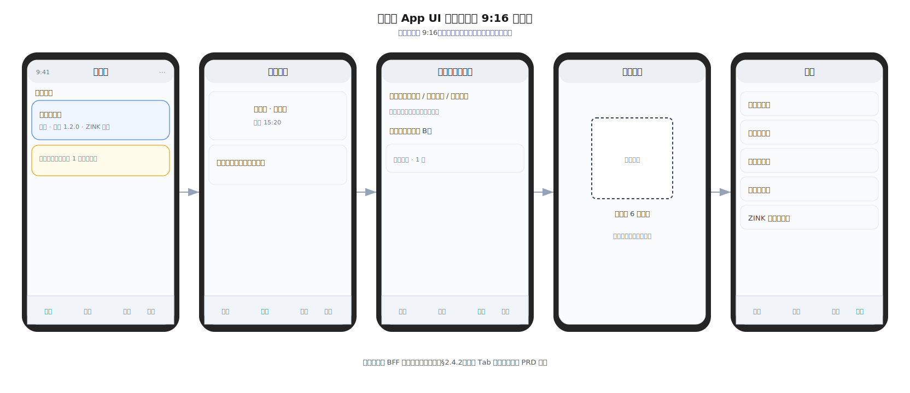
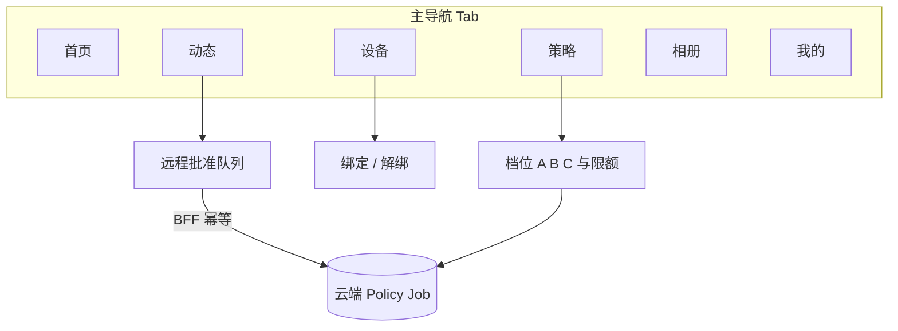

# 奇想印印（fancy-print）家长端 App 设计

> **定位**：描述 **家长使用的移动应用**（iOS / Android 或跨端框架）的产品结构、与 **整机 / 云端** 的职责边界及安全原则；并给出 **家长端 UI 功能列表** 与 **UI 设计图引用（线框 + 导航关系）**（**§5.2～§5.3**）。**不替代** [`0. 产品构想.md`](0. 产品构想.md) 中的场景与 PRD 取舍；**不替代** [`1. 项目计划书.md`](1. 项目计划书.md) 中的商业条款。  
> **关联**：设备端家长锁与 IPC 见 [`2. 端侧软件与工程样机技术分析.md`](2. 端侧软件与工程样机技术分析.md)；**端侧软件架构导读**见 [`3. 端侧设计.md`](3. 端侧设计.md)；云端编排与家长策略载体见 [`4. 服务器端设计.md`](4. 服务器端设计.md)；Phase A 中「家长端闸门 + 成长相册」见 [`1. 项目计划书.md`](1. 项目计划书.md) **§8～§9、§12**。

---

<a id="parent-app-scope"></a>

## 1 目标与产品原则

### 1.1 家长端要解决什么问题

| 诉求 | App 承担的能力 |
|------|----------------|
| **信任与可控** | 看见孩子近期创作与打印概况；在 **产品允许的档位** 下调整内容严格度、时段、是否需远程确认等。 |
| **绑定与售后** | 设备入网、账号与整机绑定、固件与常见问题入口（减轻机身「复杂设置」压力）。 |
| **安全告警** | 审核拦截、异常用量、设备离线过久等 **对家长可见** 的通知（具体事件列表以 PRD 为准）。 |
| **留存与增值（路线图）** | 成长相册、多孩档案、云存储扩容、分享去水印等（与计划书中增值方向对齐）。 |

### 1.2 核心原则（与整机 PRD 对齐）

1. **孩子仍可独立完成「说 → 看图 → 打」闭环**（[`0. 产品构想.md`](0. 产品构想.md)）：家长 App **默认**是 **伴随与治理**，而非唯一操作入口；是否启用 **「每张必经过 App 远程批准」** 由 **家庭策略** 决定（见 §3.3），与 [`4. 服务器端设计.md`](4. 服务器端设计.md) **§4.3**「机身侧为权威确认源之一」不矛盾——产品需 **显式定义** 各档位下谁为最终闸门。  
2. **最小必要数据**：默认不向家长推送 **完整语音原文**；缩略图与元数据分级展示，敏感字段遵守隐私政策与地域法规。  
3. **家长身份强于设备会话**：远程改策略、解绑设备、导出数据等 **必须** 经 **家长账号强鉴权**（见 §6）。

### 1.3 非目标（首版可不实现）

- **在 App 内直接驱动 ZINK 出纸**（打印始终在整机 `edge-daemon`）。  
- **替代机身上的儿童主交互**（大屏 + PTT 仍是孩子主路径）。  
- **开放 UGC 社区**（若做「家长社区」属远期路线图，单独 PRD）。

---

## 2 与整机、云端的边界

```mermaid
flowchart LR
  subgraph phone["家长手机"]
    PA[家长 App]
  end
  subgraph edge["整机 Edge"]
    UI[儿童 UI]
    ED[edge-daemon]
    UI <--> ED
  end
  subgraph cloud["云端"]
    BFF[家长 BFF / API]
    POL[Policy & 家庭配置]
    JOB[Job / 相册等]
    PA <-->|HTTPS| BFF
    BFF --> POL
    BFF --> JOB
    ED <-->|HTTPS MQTT| GW[API Gateway]
    GW --> JOB
```

| 能力 | 整机（儿童侧） | 家长 App | 云端 |
|------|----------------|----------|------|
| 触屏看图、本机打印确认 | ✅ 主路径 | 可推送「待你知晓」摘要 | 任务与预览 URL |
| 家长锁 / PIN | ✅ `edge-daemon` 与 UI 协同 | 远程改策略、紧急锁定（若启用） | 存储策略版本、下发 MQTT |
| 语音与 ASR | 采集与上传 | 不替代 | ASR / 编排 |
| 成长相册浏览 | 仅展示必要时可极简 | ✅ 主阵地之一 | 对象存储 + 权限 |

---

## 3 用户、家庭与设备模型

### 3.1 账号与角色

- **家庭（Household）**：一个或多个 **家长账号**（主账号 + 可选邀请成员）；**孩子** 默认 **无独立登录**（降低合规面），以 **本机使用 + 可选「孩子昵称」档案** 呈现。  
- **多孩（路线图）**：云端 `child_profile_id` 与整机策略对齐（见 [`4. 服务器端设计.md`](4. 服务器端设计.md) **§4.1**）；App 内切换「当前关注的孩子」视图。

### 3.2 设备绑定与解绑

| 方式 | 说明 |
|------|------|
| **扫码 / 短码** | 整机首次联网或「添加设备」展示 **时效二维码或 6 位短码**；App 内登录家长账号后完成绑定。 |
| **工厂或售后预绑** | ToB / 渠道机可由后台绑定主账号（流程另文）。 |
| **解绑** | 仅主账号或带 **二次验证** 的成员可操作；云端使设备 token 失效，整机进入需重新激活状态。 |

### 3.3 打印与内容策略（建议档位）

以下档位为 **产品设计选项**，实现上对应云端 **Policy** 字段与整机拉取后的行为；**默认档位**由 PRD 拍板。

| 档位 | 孩子侧 | 家长侧 | 适用 |
|------|--------|--------|------|
| **A · 机身自主** | 看图确认 + 本机家长锁即可打印 | App 仅接收摘要 / 可选告警 | 与 idea「家长不必在场」一致 |
| **B · 远程闸门** | 生成后整机 **暂锁打印** | App **允许 / 拒绝** 后云端下发解锁或作废任务 | 与儿童计划书「第三层家长闸门」验证路径一致 |
| **C · 信任时段** | 在家长设定时段内等同 A；其余等同 B | 日历 + 时段配置 | 折中方案 |

**冲突处理**：若 **B/C** 下家长长时间未响应，应有 **超时策略**（作废 / 降级为仅预览 / TTS 提示），避免孩子卡死；具体超时与文案 PRD 定义。

---

## 4 功能模块（逻辑）

### 4.1 入驻与家庭

- 注册 / 登录（手机号、邮箱或第三方 OIDC，国区合规另表）。  
- 创建家庭、邀请共管人、退出与移交主账号（路线图可细化）。

### 4.2 首页 · 设备

- 已绑定设备列表：**在线 / 离线**、固件版本、**耗材与错误摘要**（若云端或设备上报「缺纸、卡纸」等）。  
- **快捷入口**：内容策略、相册、帮助。

### 4.3 动态 · 创作时间线

- 按时间展示 **已通过审核且家长可见** 的条目：**缩略图、生成时间、是否已打印**（不默认展示完整 prompt 原文，可「展开详情」二次鉴权）。  
- **审核未通过**：展示 **中性说明** + 可选「联系客服 / 查看安全提示」，**不**向孩子端复述敏感拦截细节（与云端错误码分层一致）。

### 4.4 策略中心

- 档位 **A / B / C**（§3.3）、每日张数上限、敏感主题开关、**固件更新提醒**（跳转说明，实际 OTA 仍在整机）。  
- 与整机 **家长锁 PIN** 的关系：可设计为 **仅机身修改 PIN** 或 **App 远程重置需强验证**（安全与体验权衡写进 PRD）。

### 4.5 相册与分享（路线图）

- 与计划书 **成长相册 VIP** 对齐：云存储配额、多孩、分享去水印等 **订阅态** 在 App 内展示与购买（收银台对接另文）。  
- **导出**：家长下载到系统相册 / 文件；水印与分辨率策略产品定。

### 4.6 通知

- **推送**：审核告警、设备异常、策略变更确认、订阅到期等。  
- **应用内收件箱**：与推送同源的持久消息，便于弱网补读。

### 4.7 账号 · 隐私 · 数据主体权利

- 隐私政策、儿童个人信息处理规则、**删除家庭数据** 请求入口。  
- **注销**：冷静期 + 云端硬删除排期（与 [`4. 服务器端设计.md`](4. 服务器端设计.md) 留存策略一致）。

### 4.8 帮助与商业化触点

- 图文 FAQ、视频教程、客服入口。  
- **耗材**：ZINK 纸购买链接或电商跳转（话术与 [`../README.md`](../README.md) 一致：**ZINK 纸** 非「相纸」心智）。

---

## 5 信息架构与家长端 UI

### 5.1 一级导航（建议）

| 一级 | 二级要点 |
|------|----------|
| **首页** | 设备卡片、告警条、最近一条动态 |
| **动态** | 时间线、筛选（已打印 / 待处理）、详情 |
| **设备** | 列表、单设备详情、绑定新设备、解绑 |
| **策略** | 打印档位、时段、限额、通知开关 |
| **相册** | 网格、相册集、VIP 入口（若上线） |
| **我的** | 账号、家庭、隐私、关于、客服 |

### 5.2 家长端 UI 功能列表

下表从 **家长可见界面** 归纳能力，与 **§4 功能模块**、**§9 MVP** 对齐；实现框架（如 Flutter）与具体路由命名由工程仓库定义。

| UI 功能 | 家长目标 | 主要界面 / 交互 | 关联章节 | MVP / 路线图 |
|---------|----------|-----------------|----------|----------------|
| **注册 / 登录** | 建立可强鉴权的家长身份 | 手机号或邮箱登录、第三方 OIDC（若启用）、会话恢复 | §4.1 | MVP |
| **创建 / 管理家庭** | 共管人与主账号边界清晰 | 家庭名、邀请成员、移交主账号（若 PRD 启用） | §4.1 | MVP 可简化为单人家庭 |
| **首页 · 设备总览** | 一眼看到设备是否在线、是否要处理告警 | 设备卡片、在线点、固件与耗材摘要条 | §4.2 | MVP |
| **绑定设备** | 把整机收进家庭 | 扫码 / 短码页、成功 / 失败态、多设备列表 | §3.2、§4.2 | MVP |
| **解绑设备** | 安全退出旧机 | 二次验证、解绑确认与后果说明 | §3.2、§4.2 | MVP |
| **动态时间线** | 了解孩子创作与打印概况（最小数据） | 缩略图、时间、是否已打印；**不默认**展开完整 prompt | §4.3 | MVP（缩略） |
| **审核未通过条目** | 理解「被拦下」但不恐慌 | 中性文案、安全提示入口；**不**复述敏感拦截细节 | §4.3 | MVP |
| **待远程批准（档位 B）** | 在手机上放行或拒绝打印 | 审批列表、approve / reject、超时提示（与 §3.3 一致） | §3.3、§4.3、§6 | 增强（与档位 B 同学） |
| **策略中心** | 调档位 A/B/C、限额、时段、通知开关 | 表单 + 保存反馈；与云端 Policy 版本对齐提示 | §3.3、§4.4 | MVP 以档位 A + 限额为主 |
| **通知与收件箱** | 不漏告警、弱网可补读 | 系统推送设置跳转、应用内消息列表 | §4.6 | MVP 骨架 |
| **相册浏览 / 导出** | 留存与分享（若产品启用） | 网格、详情、下载到相册；水印策略产品定 | §4.5 | 路线图 |
| **订阅与增值** | 购买 VIP、扩容等 | 收银台 WebView 或原生 IAP（对接另文） | §4.5 | 路线图 |
| **账号 · 隐私 · 注销** | 合规与数据主体权利 | 隐私政策、删除请求、注销冷静期说明 | §4.7 | MVP 至少隐私与入口 |
| **帮助与耗材** | 自助排障、买 ZINK 纸 | FAQ、客服入口、**ZINK 纸**电商跳转（话术见仓库 README） | §4.8 | MVP |

### 5.3 家长端 UI 设计图

**说明**：下图为 **关键屏线框与主导航关系**，用于产品 / 研发对齐；**高保真视觉稿、组件库、动效** 以设计交付（Figma 等）为准。与云端路径前缀、鉴权方式见 **§6**。

#### 关键屏线框（示意）



*线框源文件：[`images/家长端-ui-线框示意.svg`](images/家长端-ui-线框示意.svg)。单屏 **9:16** 竖屏比例，中文示意；底栏 Tab 与信息层级以 PRD / 设计稿为准。*

#### 主导航与关键流（逻辑）



**与整机关系**：App **不**承担儿童主路径触屏；远程批准与策略变更经 **BFF + MQTT/轮询** 影响整机行为，边界见 **§2** 图与 [`3. 端侧设计.md`](3. 端侧设计.md)。

---

## 6 与云端交互（逻辑面）

- **独立 BFF 或路径前缀**（如 `/v1/parent/...`）：与 **设备 mTLS / 设备令牌** 通道隔离，避免把设备密钥能力暴露给手机沙箱。  
- **鉴权**：家长 **OIDC / 自建 JWT（短期）+ Refresh**；敏感操作 **二次验证**（短信 / TOTP / 生物识别仅本地解锁 App）。  
- **远程批准（档位 B）**：`POST` 某资源的 **approve / reject** 须 **幂等**；成功后由云端通过 **MQTT** 通知整机或更新 `job` 状态供整机轮询（与 [`4. 服务器端设计.md`](4. 服务器端设计.md) 编排对齐）。  
- **具体 OpenAPI**：与《服务器端设计》同仓库演进，本文件不展开字段级定义。

---

## 7 安全与隐私

| 主题 | 要求 |
|------|------|
| **传输与存储** | TLS；云端家庭数据 **按 household_id 强隔离**（行级安全）。 |
| **手机端** | 可选应用锁、截图策略（儿童预览页是否防截屏由整机实现）。 |
| **日志** | App 内诊断日志 **默认不含** 他孩与异家庭数据；崩溃上报脱敏。 |
| **合规** | 未成年人同意由 **家长代为确认**；地域化（如个人信息出境）单独清单。 |

---

## 8 非功能需求（摘要）

- **性能**：首屏与设备列表 **冷启动可接受范围内**（骨架屏 + 缓存上次状态）。  
- **弱网**：时间线分页；失败重试与 **离线可读** 最近 N 条缓存。  
- **无障碍**：字体缩放、关键按钮对比度（具体 WCAG 级别随 PRD）。  
- **版本**：与 **最低支持云端 API 版本** 兼容提示，避免旧 App 调新策略字段崩溃。

---

## 9 MVP 与路线图

| 阶段 | 家长 App 交付（建议） |
|------|------------------------|
| **MVP** | 登录注册、绑定整机、设备在线态、**动态时间线（缩略）**、基础策略（档位 A 为主 + 限额）、推送骨架、帮助入口。 |
| **增强** | 档位 B 远程闸门、多孩、相册浏览与导出。 |
| **商业** | 成长相册 VIP、耗材电商跳转、客服与工单对接。 |

---

## 10 关联文档

| 文档 | 用途 |
|------|------|
| [`0. 产品构想.md`](0. 产品构想.md) | 场景、家长授权与 PRD 要点 |
| [`4. 服务器端设计.md`](4. 服务器端设计.md) | 云端 API/MQTT、Job、家长策略载体 |
| [`3. 端侧设计.md`](3. 端侧设计.md) | **端侧整机软件**：进程、IPC、主流程、OTA、**儿童 UI 线框**（§2.4） |
| [`images/家长端-ui-线框示意.svg`](images/家长端-ui-线框示意.svg) | 家长端关键屏线框（嵌入见本文 **§5.3**） |
| [`2. 端侧软件与工程样机技术分析.md`](2. 端侧软件与工程样机技术分析.md) | 端侧 **完整**技术分析（含 BOM §10、渲染 §11） |
| [`1. 项目计划书.md`](1. 项目计划书.md) | 商业与竞品、执行 Phase A/B、家长闸门与安全、Go/No-Go |

---

**维护说明**：若 PRD 变更 **默认打印档位**（§3.3），须同步更新本文件与 [`4. 服务器端设计.md`](4. 服务器端设计.md) **§4.3**；新增 **远程批准 API** 时须注明与 **整机策略版本** 的兼容矩阵。若 **主导航结构** 或 **MVP 屏集合** 变更，须同步更新 **§5.1～§5.2**、**§5.3** Mermaid 与 [`images/家长端-ui-线框示意.svg`](images/家长端-ui-线框示意.svg)。
