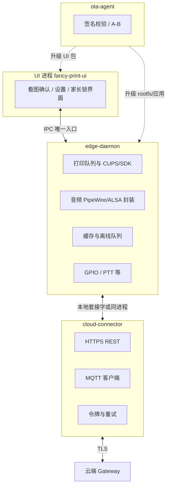
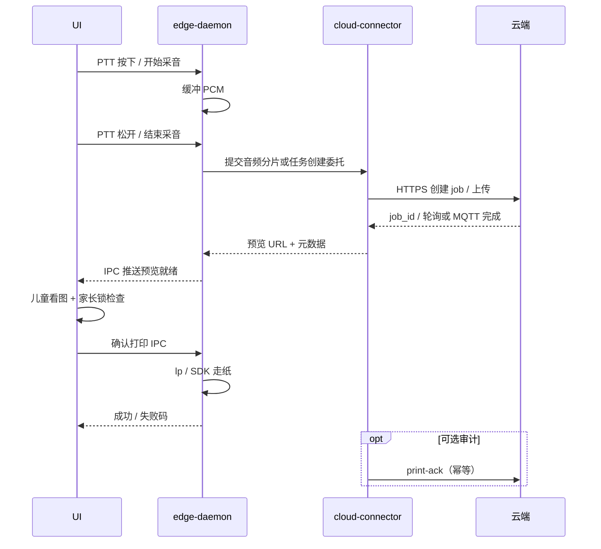

# 奇想印印（fancy-print）端侧设计

> **定位**：描述 **整机侧软件架构**（进程模型、IPC、与云端连接、打印抽象、安全与 OTA 要点），作为 **设计层导读**。**实现细节、镜像包清单、工程习惯、样机 BOM、渲染资产** 仍以 [`端侧软件与工程样机技术分析.md`](端侧软件与工程样机技术分析.md)（**Part A～C**）为权威长文。  
> **关联**：**端云总览图**见下节嵌入图（源 [`images/系统架构图.svg`](images/系统架构图.svg)）；云端见 [`服务器端设计.md`](服务器端设计.md)；家长手机见 [`家长端应用设计.md`](家长端应用设计.md)；场景与幅面见 [`产品构想.md`](产品构想.md#product-scenarios)。

---

## 总览图（端侧 + 云端）

---

## 1 目标与范围

### 1.1 端侧要解决的问题

| 能力 | 说明 |
|------|------|
| **儿童主交互** | 约 **6 寸触屏** 看图确认、**PTT** 说话、本机 **家长锁**；UI **不**直连 USB 打印字节流。 |
| **硬件与网络抽象** | 音频采集/播放、GPIO、打印队列、磁盘缓存、**弱网重试**；统一经 **`edge-daemon`** 暴露给 UI。 |
| **云上编排的客户端** | **`cloud-connector`** 负责 HTTPS/MQTT、令牌生命周期、背压；业务状态与 **`job_id`** 对齐云端（见 [`服务器端设计.md`](服务器端设计.md)）。 |
| **可升级与可运维** | **`ota-agent`** 签名包、A/B 或等价机制；**systemd** 托管、崩溃自拉起；日志可抓取且 **脱敏**。 |
| **与 PRD 一致的安全面** | 只读根、配置 overlay、与云端审核策略一致的 **端上闸门**（家长锁 + 打印确认）。 |

### 1.2 非目标

- **不在端侧默认跑完整文生图大模型**（算力与合规以云端为主路径）。  
- **不把业务规则写死在 UI 二进制内**；功能开关与策略以 **数据驱动**（见 [`端侧软件与工程样机技术分析.md`](端侧软件与工程样机技术分析.md) **§8**）。  
- **本文不展开工程样机 E1～E15 物料表**（见同文件 **§10**）**与 CMF 基准图流程**（**§11**）。

### 1.3 与云端、家长端的边界

| 维度 | 端侧 | 云端 | 家长 App |
|------|------|------|----------|
| 看图确认与本地打印 | ✅ | 提供预览 URL / 任务状态 | 可选远程闸门（策略档位） |
| ASR / 生图 / 深度审核 | 上传音频、下载图 | ✅ | — |
| 设备身份 | `cloud-connector` 使用设备凭据 | 校验、编排 | 家长账号独立通道 |

---

## 2 逻辑架构

### 2.1 进程与职责

与 [`端侧软件与工程样机技术分析.md`](端侧软件与工程样机技术分析.md) **§4** 一致，推荐四块：**UI**、`edge-daemon`、`cloud-connector`（可与 daemon 同进程或拆分）、**ota-agent**。

**硬约束**：UI 进程崩溃 **不得** 丢失 daemon 内已接受的打印任务；daemon **无界面**、可独立 OTA（见 **§6**）。

### 2.2 systemd 与依赖顺序（逻辑）

| Unit / 目标 | 说明 |
|-------------|------|
| **网络就绪** | `cloud-connector` 依赖 **WiFi/以太网** 可用后再重连 MQTT。 |
| **音频子系统** | `edge-daemon` 在 **PipeWire/ALSA** 就绪后接管设备，避免与桌面争用。 |
| **打印栈** | CUPS / 厂商守护进程先于 **`edge-daemon`** 中打印逻辑 `Ready`。 |
| **UI 最后** | kiosk 或图形会话启动后再拉起 **UI**，避免无显示连接。 |

具体 unit 片段与产测入口见 [`端侧软件与工程样机技术分析.md`](端侧软件与工程样机技术分析.md) **§7**。

---

## 3 IPC 契约（UI ↔ edge-daemon）

须在仓库内维护 **版本化** 的 **OpenAPI 或 protobuf**（[`端侧软件与工程样机技术分析.md`](端侧软件与工程样机技术分析.md) **§5.2**），至少覆盖：

| 能力域 | 要点 |
|--------|------|
| **预览** | 云端预览 URL、本地缩略图路径、过期时间；UI 只读展示。 |
| **打印任务** | `job_id`、纸张 **A5**、色彩/线稿模式、优先级、超时与取消。 |
| **错误码** | 可映射儿童友好文案：网络、审核拒绝、缺纸、卡纸、过热等。 |
| **家长锁** | 查询状态；**受控写**（如 PIN 修改）须 daemon 侧校验与审计。 |

**原则**：UI **禁止**直接调用 `lp` 或写 USB 打印机节点；所有出纸请求经 IPC **单一入口**，便于权限收敛与 mock。

---

## 4 核心运行时流程

### 4.1 冷启动到可交互

1. 内核与 systemd 拉起 CUPS/音频栈。  
2. **`edge-daemon`** 恢复本地队列与缓存索引；连接 **IPC** 监听。  
3. **`cloud-connector`** 加载设备凭据、刷新令牌、订阅 MQTT。  
4. **UI** 启动全屏；读取 **本地策略版本**；若低于云端则拉取或等待推送（见 [`服务器端设计.md`](服务器端设计.md) **§3**）。  
5. 显示「可说话 / 网络不可用」等 **由 daemon 汇总的状态**。

### 4.2 主路径：PTT → 云端成图 → 本机确认 → 打印

**家长锁**：若策略要求本机 PIN 或远程闸门，**确认打印** 前在 **D 或 U 与 D 协同** 完成校验；与 [`家长端应用设计.md`](家长端应用设计.md) **§3.3** 档位一致。

### 4.3 OTA（摘要）

- **`ota-agent`** 下载签名包 → 校验 → 切换分区或原子替换应用目录 → 重启依赖单元；失败 **回滚**（见 [`端侧软件与工程样机技术分析.md`](端侧软件与工程样机技术分析.md) **§7.6** 与同文安全章节）。  
- **UI 与 daemon 可分包升级**；IPC **主版本** 不兼容时须在镜像元数据中 **声明依赖**，避免半升级状态。

---

## 5 数据、缓存与配置

| 类别 | 建议 |
|------|------|
| **缓存目录** | 仅 **`edge-daemon`** 可写；配额与 LRU 清理；含预览图与临时音频分片。 |
| **配置 overlay** | 只读根之上的 **可写层** 存本机策略、WiFi 凭据（加密）、家长锁状态指针。 |
| **密钥** | 设备云凭据 **每机注入** 或安全元件；**禁止**硬编码进只读镜像（见 [`端侧软件与工程样机技术分析.md`](端侧软件与工程样机技术分析.md) **§8**）。 |

---

## 6 安全与可靠性（端上摘要）

| 主题 | 要求 |
|------|------|
| **TLS** | `cloud-connector` 固定证书链；是否 **证书钉扎** 随威胁模型（同《端侧软件与工程样机技术分析》）。 |
| **内容安全** | 与云端 **错误码** 对齐；儿童侧文案 **不泄露** 审核敏感细节。 |
| **看门狗** | 对 **`edge-daemon`** 强约束（**WatchdogSec=** 或业务心跳）；UI 可软重启。 |
| **日志** | 支持售后一键抓取；**默认不落** 完整语音明文。 |

---

## 7 测试与交付物（与实现联动）

与 [`端侧软件与工程样机技术分析.md`](端侧软件与工程样机技术分析.md) **§9** 对齐，阶段交付至少包括：**可刷镜像**、**daemon + UI + systemd unit**、**IPC 契约与错误码表**、**manifest 片段**、运维说明。场景测试须覆盖：**断网 / 弱网 / 云端 429/5xx / 审核拒绝 / 缺纸卡纸**。

---

## 8 文档与实现对照表

| 主题 | 本文 | 长文位置 |
|------|------|----------|
| 背景与路线一致 | §1 | [`端侧软件与工程样机技术分析.md`](端侧软件与工程样机技术分析.md) **§1～2** |
| OS 基线与 manifest | — | **§3、§3.2** |
| UI 框架选型 | — | **§5.1** |
| IPC 字段级列举 | §3 | **§5.2** |
| 打印 / 音频 / 触屏 | — | **§6** |
| Remote-SSH、镜像收口、OTA 细节 | §4.3 | [`端侧软件与工程样机技术分析.md`](端侧软件与工程样机技术分析.md) **§7、§7.6** |
| 安全与隐私配置 | §6 | **§8** |
| 测试清单 | §7 | **§9** |
| 样机 BOM / 屏规格 | — | **§10** |
| 机身基准与换壳 | — | **§11** |

---

## 9 关联文档

| 文档 | 用途 |
|------|------|
| [`端侧软件与工程样机技术分析.md`](端侧软件与工程样机技术分析.md) | 端侧 **完整**技术分析（OS～测试～BOM～渲染） |
| [`images/系统架构图.svg`](images/系统架构图.svg) | 端云一张图（嵌入见本文 **「总览图」** 节） |
| [`服务器端设计.md`](服务器端设计.md) | 云端 API/MQTT、Job、策略 |
| [`家长端应用设计.md`](家长端应用设计.md) | 家长 App、策略档位 |
| [`产品构想.md`](产品构想.md) | PRD 场景与 A5/ZINK 要点 |

---

**维护说明**：若变更 **进程边界**（例如 connector 与 daemon 合并/拆分）或 **IPC 主版本**，须同步更新本文件、[`images/系统架构图.svg`](images/系统架构图.svg) 与 **OpenAPI/proto** 仓库。
